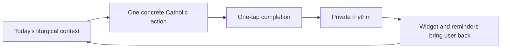

# Sống Đạo Design System

Design direction for **Sống Đạo / SongDao**, a local-first Catholic daily practice app and its landing page.

The product is not a Catholic content encyclopedia. It is a daily practice operating system:

> Sống Đạo helps Catholics live today's faith through one clear daily action, liturgical context, reminders, private tracking, and a home-screen widget.

This file is the visual and product design source of truth for:

- Flutter app UI.
- iOS WidgetKit surfaces.
- Marketing / waitlist / launch landing page.
- Future product screenshots, App Store assets, and onboarding.

---

## 1. Product Design Thesis

### Insight

Ascension wins by feeling authoritative, content-rich, and trustworthy: Bible, Catechism, Rosary, daily readings, reflections, podcasts, study plans, high ratings, social proof, and a direct download funnel. SongDao should not compete as a smaller content library.

### Decision

SongDao should own the smaller, sharper promise:

> "What should I do today to live my faith?"

Calendar, readings, feast days, Mass schedules, and prayers are inputs. The daily action loop is the product.

### Execution

Every primary surface must make this loop obvious:



Design must optimize for:

- Activation: first useful Today screen in under 10 seconds.
- Retention: widget, reminder, completion, weekly rhythm.
- Trust: Catholic, Vietnamese-ready, private, local-first.
- Distribution: landing page explains the daily loop faster than a feature list.

---

## 2. Reference Synthesis

References reviewed:

- [Ascension Press homepage](https://ascensionpress.com/pages/homepage)
- [Ascension App landing page](https://ascensionpress.com/pages/ascension-app)
- [Ascension Catholic Bible App Store page](https://apps.apple.com/us/app/ascension-catholic-bible/id1660909501)

What to learn:

- Lead with one clear category claim.
- Show app screenshots early.
- Use trust proof near the top: ratings, users, testimonials, recognizable features.
- Make download conversion obvious through App Store buttons, QR code, or phone/email capture.
- Keep the content ecosystem visible, but package it into simple paths.

What not to copy:

- Do not position SongDao as "the complete Catholic Bible app."
- Do not lead with dozens of content modules.
- Do not require account signup for the core promise.
- Do not use trust proof we do not yet have.
- Do not borrow Ascension's blue/yellow identity, Bible Timeline visual language, or content-library hierarchy.

SongDao's visual lane:

> A calm Vietnamese Catholic chapel notebook translated into a modern mobile utility.

---

## 3. Brand Principles

### Core Feeling

The product should feel:

- Quiet, sacred, and practical.
- Warm but not nostalgic.
- Native, fast, and daily-use friendly.
- Vietnamese Catholic by default.
- Private and non-judgmental.
- Offline-capable without drama.

### Brand Words

Use these words to guide visual decisions:

- Daily
- Gentle
- Sacred
- Practical
- Local
- Private
- Vietnamese
- Faithful

Avoid:

- Grand
- Academic
- Gamified
- Ornamental
- Content-heavy
- Influencer-led
- Shame-based

### Product Promise

Primary:

> Một việc nhỏ để sống đức tin hôm nay.

English support line:

> One clear Catholic action for today.

---

## 4. Color System

Use semantic roles first. Liturgical colors are compact meaning signals, not the whole UI.

### Core Surfaces

| Token | Hex | Role |
|---|---:|---|
| `surface.canvas` | `#FAF8F3` | Main app and landing background |
| `surface.primary` | `#FFFFFF` | Cards, sheets, forms, screenshot frames |
| `surface.secondary` | `#F3F0E8` | Grouped sections, landing bands, calendar bands |
| `surface.container` | `#F0EEE8` | Subtle controls and inset surfaces |
| `surface.variant` | `#E5E2DC` | Disabled surfaces and dividers |
| `surface.inverse` | `#18221E` | Dark widget, footer, high-contrast landing strip |

### Text

| Token | Hex | Role |
|---|---:|---|
| `text.primary` | `#1F2522` | Headings, primary body |
| `text.secondary` | `#5F6761` | Supporting labels and descriptions |
| `text.tertiary` | `#8A938D` | Metadata, placeholders |
| `text.inverse` | `#F8F5ED` | Text on dark surfaces |
| `text.link` | `#1B6E5A` | Links and tappable text |

### Brand & Interaction

| Token | Hex | Role |
|---|---:|---|
| `brand.primary` | `#1F7A64` | Primary CTA, selected nav, focus |
| `brand.primaryPressed` | `#155744` | Pressed primary state |
| `brand.soft` | `#E2F1EA` | Selected chips, complete states, soft CTA bands |
| `brand.deep` | `#123C32` | High-emphasis text on green surfaces |
| `accent.gold` | `#B8892E` | Solemnity, sacred emphasis, landing proof accents |
| `accent.burgundy` | `#8F2F3D` | Lent, sacrifice, confession preparation |
| `accent.blue` | `#2F5F8F` | Marian content, informational states |

### Liturgical Colors

Use as left rails, dots, small badges, icon tints, calendar markers, widget accent strips, and screenshot annotations.

| Token | Hex | Use |
|---|---:|---|
| `liturgical.green` | `#2F7D4F` | Ordinary Time |
| `liturgical.white` | `#F7F3E8` | Christmas, Easter, solemnities |
| `liturgical.gold` | `#C69A3D` | High feast emphasis |
| `liturgical.red` | `#B33A3A` | Martyrs, Palm Sunday, Good Friday |
| `liturgical.purple` | `#6B4A7A` | Advent, Lent, penance |
| `liturgical.rose` | `#C9788D` | Gaudete and Laetare Sundays |
| `liturgical.black` | `#242424` | Rare memorial usage only |

### Status Colors

| Token | Hex | Role |
|---|---:|---|
| `status.complete` | `#2F7D4F` | Completed daily action |
| `status.warning` | `#B8892E` | Missing content, stale Mass data |
| `status.error` | `#B33A3A` | Import/sync failure |
| `status.offline` | `#5F6761` | Offline indicator |

### Borders & Shadows

| Token | Value | Role |
|---|---|---|
| `border.subtle` | `#E2DDD1` | Cards, list dividers |
| `border.strong` | `#CFC7B7` | Inputs, selected boundaries |
| `border.focus` | `#1F7A64` | Accessibility focus ring |
| `shadow.level2` | `0 6px 18px rgba(31, 37, 34, 0.08)` | Bottom sheets, sticky bars |
| `shadow.level3` | `0 16px 40px rgba(31, 37, 34, 0.16)` | Dialogs only |

Do not use glow effects, bokeh, decorative orbs, glassmorphism, or app-wide purple/gold dominance.

---

## 5. Typography

The current Flutter theme uses:

- Inter for body/UI.
- Noto Serif for major headings and navigation labels.

Keep that direction. It gives SongDao a sacred editorial note without making the app feel old.

### Type Scale

| Role | Size | Weight | Line Height | Use |
|---|---:|---:|---:|---|
| `display` | 32-40 | 600-700 | 1.20 | Landing hero, Today action title |
| `headlineLarge` | 28-32 | 600-700 | 1.25 | Screen title, major landing sections |
| `headline` | 24 | 600 | 1.35 | Major card title |
| `titleLarge` | 20-22 | 600 | 1.35 | Section title, widget large title |
| `title` | 18 | 600 | 1.35 | Card title, selected day title |
| `bodyLarge` | 17-18 | 400 | 1.50 | Reflection prompt, devotional reading |
| `body` | 15 | 400 | 1.45 | Standard UI body |
| `label` | 14 | 600 | 1.30 | Buttons, tabs, chips |
| `caption` | 13 | 500-600 | 1.30 | Metadata, feast rank, time labels |
| `micro` | 11 | 600 | 1.20 | Calendar dots, compact widget labels |

### Rules

- Vietnamese diacritics must never feel cramped.
- Letter spacing should be `0` in most UI. Avoid all caps except compact chips.
- Long feast names must wrap to two lines.
- The daily action title gets the strongest treatment in the app.
- The landing page headline may be bigger, but app screens stay utility-dense.

### Copy Tone

Good:

- "Một việc nhỏ hôm nay"
- "Cầu nguyện 5 phút"
- "Viết một câu suy niệm"
- "Nhịp sống tuần này"
- "Dữ liệu này đang lưu trên thiết bị"
- "Chọn giáo xứ của bạn"

Avoid:

- "Faith score"
- "Prove you attended Mass"
- "You failed today"
- "Become a better Catholic"
- Overly sentimental religious copy

---

## 6. App Component System

### App Shell

Bottom navigation:

1. Today
2. Calendar
3. Pray
4. Church
5. Progress

Rules:

- Today is the home destination.
- Use icons plus short labels.
- Selected state uses `brand.primary`.
- Background uses `surface.secondary`.

### Today Header

Purpose: identify the liturgical day quickly.

Structure:

- Solar date.
- Optional lunar date.
- Liturgical season.
- Celebration or weekday title.
- Liturgical color marker.

Styling:

- White or warm-white surface.
- 8px radius.
- 1px `border.subtle`.
- 4px liturgical color rail or small circular marker.
- No heavy religious imagery.

### Daily Action Card

This is the most important component.

Structure:

- Small context label: season or rule source.
- Large action title.
- Duration chip.
- Prompt text.
- Primary completion button.
- Optional note affordance.

Rules:

- One primary action only.
- Completion is one tap.
- Secondary actions must not visually compete.
- Completed state uses `brand.soft` and `status.complete`.
- Note entry appears after completion or through a quiet secondary action.

### Reading Reference Card

Purpose: support action without turning MVP into a licensed Bible product.

Structure:

- Reading type.
- Citation.
- Optional short legally safe excerpt or source link.
- "View readings" action.

Rules:

- References first, full text only when licensing is solved.
- Never visually outrank the daily action.

### Important Mass Card

Purpose: help the user prepare for Sunday, solemnities, and parish rhythm.

Structure:

- Next important Mass time.
- Church name.
- Context: Sunday, solemnity, weekday.
- Last verified state.
- Change parish / suggest correction affordance.

Rules:

- Time first.
- Stale data gets warning styling, not error styling.
- Distance appears only after location permission.

### Progress Components

Progress must feel private and gentle.

Use:

- Weekly rhythm row.
- Completed action list.
- Reflection notes.
- Soft streak language.

Do not use:

- Public ranking.
- Red missed-day states.
- Aggressive gamification.
- Shame-based empty states.

### Buttons

Primary:

- Background: `brand.primary`.
- Text: white.
- Height: 48px minimum.
- Radius: 8px.
- Pressed: `brand.primaryPressed`.

Use for:

- "I did this"
- "Choose my parish"
- "Save reminder"
- Landing page "Join waitlist" / "Download"

Secondary:

- Background: `surface.primary`.
- Border: `border.subtle` or `border.strong`.
- Text: `text.primary`.
- Height: 44px minimum.
- Radius: 8px.

Quiet:

- Transparent.
- Text: `text.link`.
- Use for inline low-risk navigation.

### Cards

Use cards only for individual information units:

- Daily action.
- Reading references.
- Important Mass.
- Weekly rhythm summary.
- Parish row.
- Prayer item.
- Landing page proof item or feature item.

Rules:

- Radius: 8px.
- Border: 1px `border.subtle`.
- Background: `surface.primary`.
- Shadow: none by default.
- Do not nest cards inside cards.

### Inputs

Use native-feeling inputs:

- Background: `surface.primary` in cards or `surface.secondary` on page canvas.
- Border: `border.strong`.
- Focus: `brand.primary`.
- Radius: 8px.
- Height: 48px minimum.
- Placeholder: `text.tertiary`.
- Search fields include search icon and clear button.

### Chips & Badges

Use chips for:

- Liturgical season.
- Duration.
- Reading type.
- Mass time.
- Offline.
- Last verified.

Rules:

- Pill radius.
- Height: 28px.
- Text: 13px, weight 600.
- Avoid more than three chips per row on mobile.

---

## 7. App Screen Guidance

### Today

User outcome: understand the day and complete one act.

Order:

1. Liturgical context.
2. Daily action.
3. Completion state.
4. Reading references.
5. Important Mass.
6. Reflection note.

Design priority:

- Daily action card is visually dominant.
- Reading references are supportive.
- Mass is planning-oriented.
- Notes are private and quiet.

### Calendar

User outcome: see what is coming and prepare.

Required:

- Week strip or month view.
- Liturgical color markers.
- Upcoming solemnities/Sundays.
- Action preview for selected day.

Design priority:

- Scannable before comprehensive.
- Selected day should connect back to Today/action.

### Pray

User outcome: access a small useful prayer library.

Required:

- Daily prayer.
- Rosary.
- Confession preparation.
- Common prayers.
- Saved prayers.

Design priority:

- Calm reading experience.
- Large enough text.
- Minimal controls while reading.

### Church

User outcome: know my parish and next important Mass.

Required:

- My parish.
- Next Mass.
- Search.
- Mass schedule.
- Suggest correction.

Design priority:

- Time and location clarity beat visual polish.
- Always show last verified when available.

### Progress

User outcome: reflect on private rhythm.

Required:

- This week.
- Completed actions.
- Notes.
- Review prompt.

Design priority:

- Gentle trend, not judgment.
- Use green for completion, not moral worth.

---

## 8. Widget System

Widget design must be simpler than in-app screens.

Small:

- Date or weekday.
- Liturgical color marker.
- Short action title.

Medium:

- Date.
- Celebration.
- Action.
- Gospel reference or Mass time.

Large:

- Today context.
- Action.
- Reflection prompt.
- Important Mass.

Rules:

- Use high contrast.
- Avoid tiny paragraphs.
- Prefer one clear action.
- Widget snapshots come from local data.
- Do not promise live widget updates.
- Dark seasonal widgets may use `surface.inverse`.

---

## 9. Landing Page Design System

### Landing Page Job

The landing page is not a brochure. It has one job:

> Convert a Catholic visitor into a waitlist signup, TestFlight install, App Store download, or parish/content partner lead.

Primary audience:

- Vietnamese Catholics who want a daily rhythm.
- Busy Catholics who need reminders and structure.
- Parish-connected users who care about Mass and feast context.

Secondary audience:

- Priests, parish volunteers, Catholic creators, and early supporters.

### Positioning

Headline options:

- "Một việc nhỏ để sống đức tin hôm nay."
- "Sống Đạo: one clear Catholic action for today."
- "Your daily Catholic rhythm, right on your home screen."

Do not lead with:

- "Catholic calendar app."
- "Bible app."
- "Prayer app."
- "All-in-one Catholic platform."

### Landing Page Structure

Recommended launch page:

1. Hero.
2. App loop section.
3. Screenshot strip.
4. Why it is different.
5. Privacy / local-first proof.
6. Widget and reminders.
7. Parish / Mass module.
8. Waitlist or download CTA.
9. FAQ.
10. Footer.

### Hero

Purpose: explain the promise in five seconds.

Layout:

- Left/top: headline, short supporting copy, primary CTA.
- Right/below: real app screenshot or phone mockup showing Today screen.
- Include one compact trust line only when true.

Hero copy:

```txt
Một việc nhỏ để sống đức tin hôm nay.

Sống Đạo turns the Catholic calendar into one clear daily action, with readings, parish Mass context, reminders, private tracking, and a home-screen widget.
```

CTA hierarchy:

- Primary: "Join the beta" or "Download on the App Store".
- Secondary: "See how it works".

Rules:

- Use product screenshots, not abstract religious art.
- Do not put the hero text inside a card.
- Avoid giant decorative gradients.
- Keep a hint of the next section visible on desktop and mobile.

### App Loop Section

Show three steps:

1. See today's context.
2. Do one small action.
3. Build a private rhythm.

Each step should use a screenshot crop or compact UI illustration from the actual app.

### Screenshot Strip

Use 3-5 phone screenshots:

- Today.
- Widget.
- Calendar.
- Church / Mass.
- Progress.

Rules:

- Screenshots should be legible.
- Use real UI states, not empty placeholders.
- Keep phone frames simple.
- Do not use dark blurred backgrounds behind phones.

### Difference Section

Compare by category, not by attacking competitors.

Suggested copy:

| Other apps help you... | Sống Đạo helps you... |
|---|---|
| Read more Catholic content | Choose one concrete action today |
| Check feast days and readings | Turn the day into practice |
| Track public or generic habits | Build a private Catholic rhythm |
| Depend on cloud accounts | Keep the core loop local-first |

### Privacy / Local-First Section

This is a conversion asset, not just a technical note.

Message:

> Your practice history and notes stay on your device unless you choose backup.

Show:

- No account required for MVP.
- Notes local by default.
- Offline Today screen.
- Location only when using nearby church search.
- Analytics opt-in only.

### Widget Section

Purpose: sell retention visually.

Message:

> The home screen becomes a gentle reminder to live today's faith.

Show:

- Small, medium, and large widget mockups.
- One clear daily action.
- Liturgical accent.

### Parish / Mass Section

Purpose: win Vietnamese parish-connected users.

Message:

> Choose your parish and see the next important Mass in context.

Show:

- My parish card.
- Next Sunday or solemnity Mass.
- Last verified state.

### Social Proof

Use only truthful proof.

Pre-launch proof options:

- "Built for Vietnamese Catholic daily practice."
- "Local-first by design."
- "Beta opening soon."
- Quotes from beta users after we have them.

Do not invent:

- Ratings.
- Download counts.
- Parish endorsements.
- Clergy endorsement.

### FAQ

Minimum questions:

- Is this a Bible app?
- Does it work offline?
- Do I need an account?
- Are my notes private?
- Is it only for Vietnamese Catholics?
- Will it include Mass times?
- Is it free?

### Landing Page Visual Tokens

Use the same color system as the app.

Add landing-specific roles:

| Token | Value | Role |
|---|---:|---|
| `landing.heroBackground` | `#FAF8F3` | First viewport |
| `landing.bandSoft` | `#F3F0E8` | Alternating sections |
| `landing.proofAccent` | `#B8892E` | Small trust markers |
| `landing.footer` | `#18221E` | Footer |

### Landing Page Layout

Mobile:

- Single column.
- Hero screenshot below copy.
- CTA visible above fold.
- 16px horizontal padding.
- Screenshots swipe horizontally only if necessary.

Tablet:

- Centered max-width content.
- Hero can use two columns.
- Screenshot strip remains readable.

Desktop:

- Max content width: 1120px.
- Hero uses 52/48 text-to-product split.
- Sections use full-width bands with constrained inner content.
- Avoid floating card stacks.

### Landing Page Metrics

Design should support:

- Waitlist conversion.
- TestFlight/App Store click-through.
- Scroll depth to screenshot strip.
- FAQ engagement.
- Parish/content partner inquiry.

Do not add analytics until privacy copy and opt-in policy are clear.

---

## 10. Layout & Spacing

Use an 8px base grid.

| Token | Value |
|---|---:|
| `space.1` | 4 |
| `space.2` | 8 |
| `space.3` | 12 |
| `space.4` | 16 |
| `space.5` | 20 |
| `space.6` | 24 |
| `space.8` | 32 |
| `space.10` | 40 |
| `space.12` | 48 |
| `space.16` | 64 |
| `space.20` | 80 |

App screen padding:

- Mobile: 16px.
- Dense utility screens: 12px allowed.
- Tablet max content width: 720px.
- Desktop/web app max content width: 960px.

Landing page padding:

- Mobile: 16px.
- Tablet: 32px.
- Desktop: 48px.
- Max content width: 1120px.

Density:

- App: compact, scannable, utility-first.
- Landing page: more breathing room, but still product-led.

---

## 11. Motion & Interaction

Motion should be subtle and respectful.

Use:

- 120-180ms button press transitions.
- 180-240ms sheet transitions.
- Gentle completion check animation.
- Calendar selection transition.
- Landing page screenshot fade/slide only if it does not slow page load.

Avoid:

- Confetti for religious practice.
- Over-celebrating streaks.
- Constant pulsing.
- Decorative page animations.
- Heavy parallax.

Completion feedback:

- Button changes to completed state.
- Small check icon appears.
- Optional note prompt slides in.
- Weekly rhythm updates quietly.

---

## 12. Accessibility & States

### Touch Targets

- Minimum: 44px.
- Preferred primary button: 48px.
- Calendar day cells: 44px minimum on mobile.

### Contrast

All text must meet WCAG AA:

- `text.primary` on `surface.canvas`.
- White text on `brand.primary`.
- `text.secondary` on white.
- Liturgical color badges with appropriate text contrast.

### Focus

- 2px `border.focus`.
- 2px offset when possible.
- Never rely only on color.

### Offline States

Offline is normal, not an error.

Use:

- Small offline chip.
- Neutral copy.
- Cached content.

Copy:

> Offline mode. Today's data is saved on this device.

### Error States

Use human, specific copy:

- "Calendar pack could not be imported."
- "Mass times may be outdated."
- "Widget data will refresh after opening the app."

Avoid generic "Something went wrong" unless no recoverable detail exists.

---

## 13. Responsive Behavior

| Name | Width | Behavior |
|---|---:|---|
| Small mobile | `<360` | Single column, compact cards, shorter labels |
| Mobile | `360-599` | Primary app target |
| Tablet | `600-899` | Centered content, optional two-column sections |
| Large tablet/web | `900+` | Max-width layout, Today can use side panel |

Mobile rules:

- Primary actions stay above the fold when possible.
- Long feast names wrap to two lines.
- Bottom navigation labels remain visible unless space is extremely tight.
- Avoid horizontal scrolling except week strips and landing screenshot strips.

Tablet/web app rules:

- Today layout may split into two columns:
  - Left: daily action and completion.
  - Right: readings, Mass, rhythm.
- Do not turn the app into a desktop dashboard unless the platform requires it.

---

## 14. Flutter Token Mapping

Use the small token layer in `songdao/lib/app/theme.dart`.

Core color mapping:

```dart
class AppColors {
  static const canvas = Color(0xFFFAF8F3);
  static const surface = Color(0xFFFFFFFF);
  static const surfaceSecondary = Color(0xFFF3F0E8);
  static const surfaceContainer = Color(0xFFF0EEE8);
  static const surfaceVariant = Color(0xFFE5E2DC);
  static const inverse = Color(0xFF18221E);

  static const textPrimary = Color(0xFF1F2522);
  static const textSecondary = Color(0xFF5F6761);
  static const textTertiary = Color(0xFF8A938D);
  static const textInverse = Color(0xFFF8F5ED);
  static const textLink = Color(0xFF1B6E5A);

  static const brand = Color(0xFF1F7A64);
  static const brandPressed = Color(0xFF155744);
  static const brandSoft = Color(0xFFE2F1EA);
  static const brandDeep = Color(0xFF123C32);

  static const gold = Color(0xFFB8892E);
  static const burgundy = Color(0xFF8F2F3D);
  static const marianBlue = Color(0xFF2F5F8F);

  static const borderSubtle = Color(0xFFE2DDD1);
  static const borderStrong = Color(0xFFCFC7B7);
  static const borderFocus = Color(0xFF1F7A64);
}
```

Liturgical color helper:

```dart
Color liturgicalColor(String value) {
  switch (value) {
    case 'green':
      return LiturgicalColors.green;
    case 'white':
      return LiturgicalColors.white;
    case 'gold':
      return LiturgicalColors.gold;
    case 'red':
      return LiturgicalColors.red;
    case 'purple':
      return LiturgicalColors.purple;
    case 'rose':
      return LiturgicalColors.rose;
    case 'black':
      return LiturgicalColors.black;
    default:
      return AppColors.brand;
  }
}
```

Implementation rule:

- Prefer native Material components with light theming.
- Add custom widgets only when they directly serve Today, widget, Mass, prayer, or progress flows.

---

## 15. Do's And Don'ts

### Do

- Make Today screen the product center.
- Use one clear daily action.
- Use liturgical colors as signals.
- Keep progress private and kind.
- Design offline states as first-class states.
- Prioritize readable Vietnamese text.
- Use icons for navigation and compact actions.
- Keep cards flat, bordered, and purposeful.
- Make widgets highly scannable.
- Let the landing page sell the daily loop with real screenshots.

### Don't

- Lead with a content library.
- Turn the app into a full Bible reader in MVP.
- Use public virtue scoring.
- Add decorative religious clutter.
- Use giant marketing hero layouts inside the app.
- Use purple or gold as dominant app-wide themes.
- Hide stale parish/Mass data.
- Use shame copy for missed practice.
- Promise live widget updates.
- Invent social proof before launch.
- Make landing page visuals that do not show the real product.

---

## 16. Agent Prompt Guide

When generating app UI:

> Build a calm, local-first Catholic daily practice UI. Warm off-white canvas `#FAF8F3`, white cards, ink text `#1F2522`, chapel green primary `#1F7A64`, restrained liturgical accents. Use flat 8px-radius cards with subtle borders. Make Today/action the visual center. Vietnamese text must wrap cleanly. No decorative clutter, no public scoring, no giant marketing hero inside the app.

When generating landing page UI:

> Build a product-led landing page for Sống Đạo, a local-first Catholic daily practice app. Lead with "Một việc nhỏ để sống đức tin hôm nay", show a real Today screen phone mockup above the fold, explain the loop in three steps, then show widget, privacy, parish Mass, screenshots, CTA, and FAQ. Use the app color tokens, restrained Catholic warmth, no decorative gradients, no fake social proof, and no content-library positioning.

### Iteration Rules

1. If a new screen does not advance daily action, private rhythm, parish planning, prayer access, activation, retention, or revenue, challenge it.
2. Keep app UI dense enough for daily utility.
3. Let landing page UI breathe enough to convert.
4. Liturgical colors should mark meaning, not dominate the palette.
5. Use local/offline states everywhere content appears.
6. Prefer simple shippable layouts first; polish after the MVP loop works.
