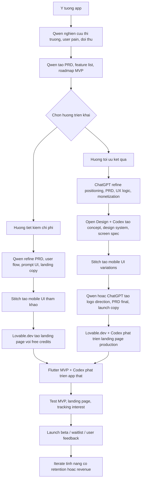
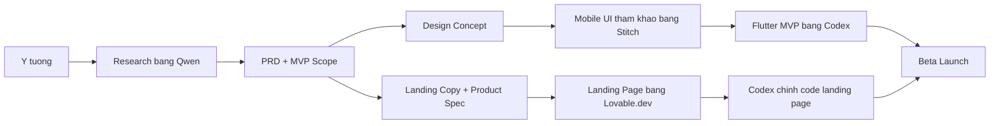

# Quy trinh build app bang AI cho solo founder

## Bai viet Facebook

Minh dang chuan hoa lai quy trinh build app bang AI cho solo founder.

Diem quan trong khong phai la dung that nhieu tool, ma la biet tool nao lam viec gi de di tu y tuong -> ban thiet ke -> MVP -> landing page nhanh nhat.

Flow minh de xuat:

**Y tuong -> Qwen nghien cuu -> Open Design + Codex concept -> Stitch mobile UI -> Qwen/ChatGPT tao PRD + logo -> Flutter MVP bang Codex -> Landing page bang Lovable.dev + Codex**

Co 2 huong trien khai:

## 1. Tiet kiem chi phi toi da

Dung Qwen lam trung tam:

- Research y tuong
- Viet PRD
- Len feature list
- Tao ke hoach trien khai
- Viet prompt cho UI va landing page

Sau do dung:

- Stitch de tao mobile UI tham khao
- Lovable.dev de dung landing page bang free credits
- Codex chi dung khi can chinh code hoac build MVP that

Phu hop khi muon test nhanh y tuong ma chua muon ton nhieu tien.

## 2. Toi uu ket qua

Ket hop Qwen + ChatGPT + Codex:

- Qwen research rong
- ChatGPT refine positioning, PRD, UX, monetization
- Open Design + Codex tao concept design, design system, UI spec
- Stitch tao mobile UI nhanh
- Codex build Flutter MVP va chinh landing page production

Phu hop khi da chon duoc y tuong dang lam va muon day nhanh tu concept sang san pham that.

Diem minh rut ra:

AI khong thay founder.
AI giup founder giam thoi gian tu "y tuong mo ho" thanh "ban co the test voi nguoi dung".

Neu lam dung, mot solo founder co the di tu idea -> PRD -> UI -> MVP -> landing page trong vai ngay thay vi vai tuan.

---

## Caption ngan

Quy trinh build app bang AI cho solo founder:

**Idea -> Research -> PRD -> Design -> Mobile UI -> Flutter MVP -> Landing page -> Beta launch**

Dung tiet kiem:

- Qwen cho research + PRD
- Stitch cho UI tham khao
- Lovable.dev cho landing page
- Codex khi can chinh code

Dung toi uu:

- Qwen research
- ChatGPT refine san pham
- Open Design + Codex tao concept
- Codex build Flutter MVP that

Muc tieu khong phai dung nhieu AI tool.
Muc tieu la ship nhanh hon, ro hon, it ton hon.

---

## Flow tong the

## Flow rut gon

## Hinh anh dinh kem

- `01-quy-trinh-build-app-bang-ai.png`
- `02-hai-cach-build-app-bang-ai.png`

