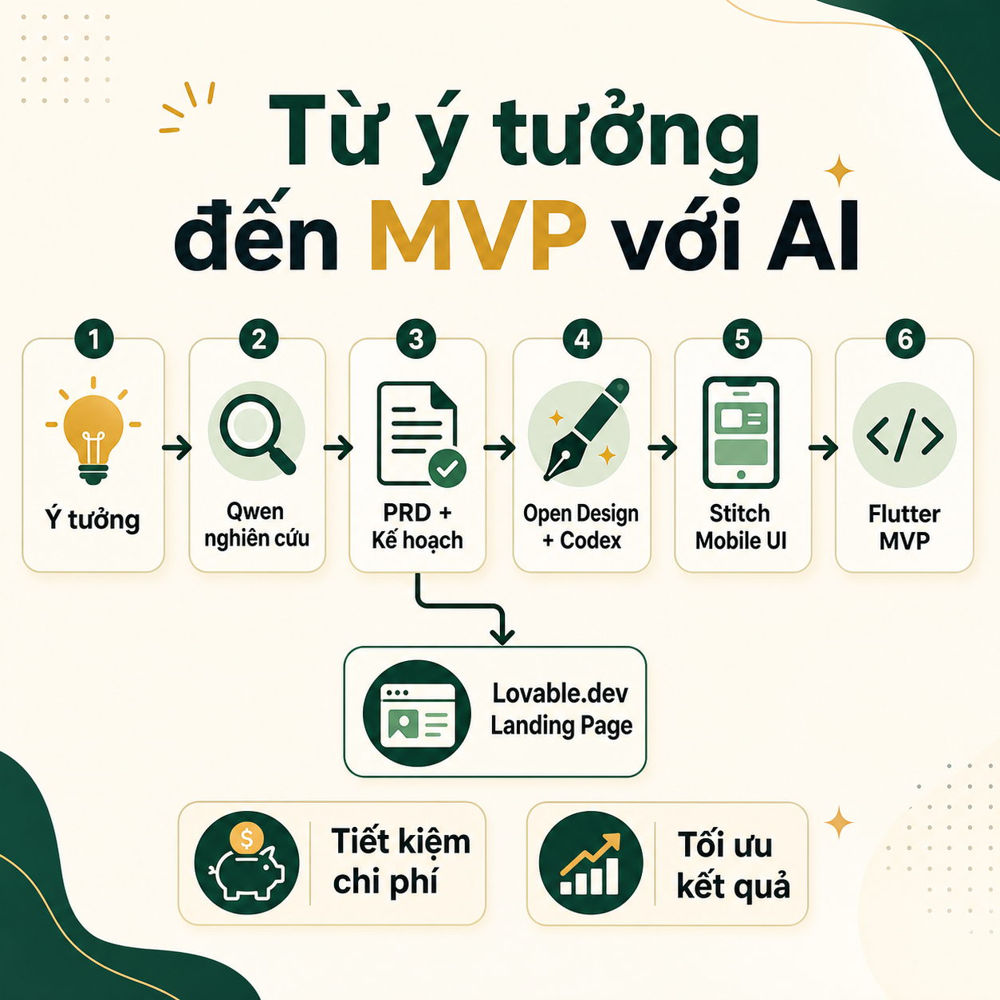
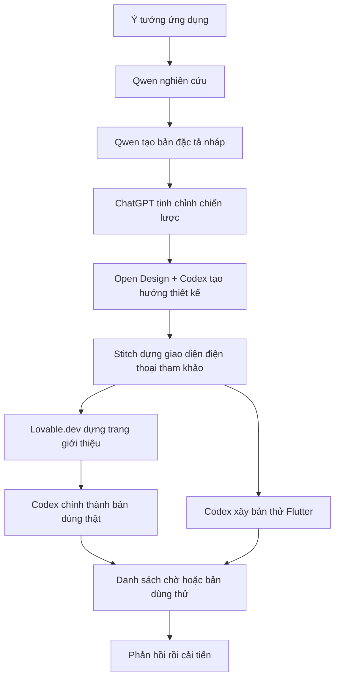
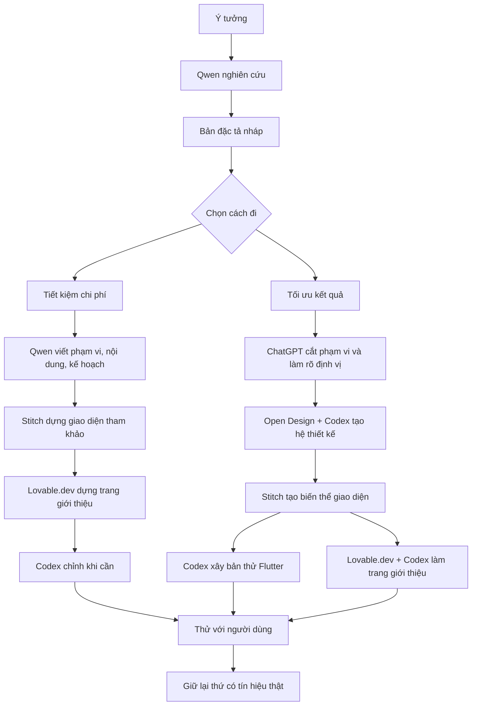
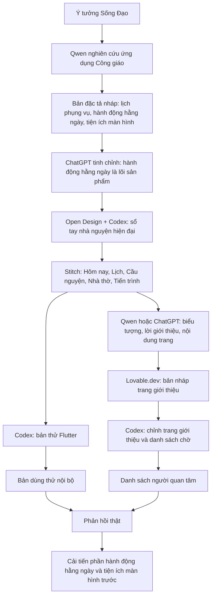

# Tôi đang dùng AI để biến ý tưởng ứng dụng thành bản thử đầu tiên nhanh hơn như thế nào

Tôi đang thử một quy trình mới để biến một ý tưởng ứng dụng thành bản thử đầu tiên nhanh hơn, rẻ hơn, nhưng vẫn đủ nghiêm túc để sau này có thể xây thành sản phẩm thật.

Điểm quan trọng không nằm ở việc dùng thật nhiều công cụ AI. Ngược lại, tôi đang cố làm ít thứ hơn, rõ thứ tự hơn, và ép mỗi bước phải tạo ra một kết quả cụ thể trước khi đi tiếp.

Vì nếu làm sản phẩm một mình, cái bẫy lớn nhất không phải là thiếu ý tưởng. Cái bẫy lớn nhất là có quá nhiều ý tưởng, quá nhiều công cụ, quá nhiều bản nháp, nhưng không có một phiên bản nào đủ rõ để đưa cho người dùng thử.

Tôi đã bị mắc kẹt ở chỗ đó nhiều lần.

## Vì sao tôi cần một quy trình mới

Tôi là người xây sản phẩm một mình. Điều đó có nghĩa là mỗi ý tưởng đều phải trả bằng thời gian, tiền công cụ, năng lượng thiết kế, năng lượng viết mã, và cả sự tập trung.

Nếu một nhóm lớn chọn sai hướng, họ có thể chia người ra sửa. Còn người làm một mình thì không có nhiều lớp đệm như vậy. Một quyết định sai về phạm vi sản phẩm có thể kéo theo nhiều ngày chỉnh giao diện, viết lại bản đặc tả, sửa kiến trúc, rồi cuối cùng vẫn chưa có gì đem đi thử thị trường.

Trước đây, tôi hay bắt đầu theo kiểu khá tự nhiên:

- Có một ý tưởng nghe có vẻ hay.
- Nghiên cứu một chút.
- Viết bản đặc tả sản phẩm.
- Nhảy qua giao diện.
- Nhìn giao diện xong lại muốn đổi phạm vi.
- Sửa lại tính năng.
- Rồi quay về viết lại mô tả.
- Cuối cùng tốn thời gian, tốn lượt dùng công cụ, nhưng chưa có bản thử chạy được.

Vấn đề không phải là từng bước sai. Vấn đề là thứ tự sai.

Tôi nhận ra mình cần một quy trình có ba lớp rõ ràng:

1. Suy nghĩ sản phẩm.
2. Suy nghĩ thiết kế.
3. Xây bản thật.

Khi ba lớp này bị trộn vào nhau, mọi thứ rất dễ thành một vòng lặp đẹp nhưng tốn kém: nghiên cứu chưa xong đã làm giao diện, giao diện chưa rõ đã viết mã, viết mã xong mới nhận ra lõi sản phẩm chưa chắc đúng.

## Vấn đề của cách làm cũ

Cách làm cũ của tôi có một lỗi nền tảng: tôi để giao diện kéo sản phẩm đi quá sớm.

Một bản giao diện đẹp rất dễ tạo cảm giác rằng sản phẩm đã rõ. Nhưng nhiều khi đó chỉ là một bức tranh đẹp cho một ý tưởng còn mơ hồ.

Với ứng dụng di động, điều này càng nguy hiểm. Một màn hình đẹp có thể che đi những câu hỏi quan trọng hơn:

- Người dùng mở ứng dụng để làm gì trong 10 giây đầu?
- Tính năng nào khiến họ quay lại ngày mai?
- Dữ liệu nào phải có ngay từ đầu?
- Cái gì có thể bỏ khỏi phiên bản đầu tiên?
- Trang giới thiệu đang bán lời hứa nào?
- Bản thử đầu tiên có kiểm chứng được nhu cầu thật không?

Nếu chưa trả lời được những câu hỏi đó, giao diện chỉ nên là bản nháp để nhìn ý tưởng rõ hơn, không nên là thứ quyết định sản phẩm.

Tôi cũng nhận ra một sai lầm khác: dùng AI như một cái máy tạo tài liệu, thay vì dùng nó như một hệ thống đưa sản phẩm đi qua từng cửa kiểm tra.

Một bản đặc tả dài không có nghĩa là sản phẩm đã tốt hơn. Một danh sách tính năng dài không có nghĩa là bản thử đầu tiên mạnh hơn. Một trang giới thiệu đẹp không có nghĩa là thị trường muốn nó.

Vì vậy, tôi bắt đầu đặt lại câu hỏi:

Nếu tôi chỉ có vài ngày để kiểm chứng một ý tưởng, quy trình tối giản nhất là gì?

## Cách tôi tách lại quy trình

Tôi đang chia quy trình thành ba lớp.

Lớp đầu tiên là suy nghĩ sản phẩm. Ở đây, tôi dùng Qwen để nghiên cứu rộng: người dùng, vấn đề, đối thủ, lựa chọn thay thế, góc khác biệt, và phạm vi nhỏ nhất nên thử. Nếu cần nâng chất lượng quyết định, tôi đưa bản nháp qua ChatGPT để cắt phạm vi, làm rõ định vị, và biến ý tưởng thành một bản đặc tả có thể xây.

Lớp thứ hai là suy nghĩ thiết kế. Ở đây, tôi không bắt đầu bằng việc làm giao diện cuối cùng. Tôi bắt đầu bằng hướng thiết kế: cảm giác sản phẩm, hệ màu, phân cấp màn hình, thành phần giao diện, và cách chuyển ý tưởng thành các màn hình cụ thể. Open Design kết hợp với Codex phù hợp cho phần này vì có thể tạo tài liệu thiết kế có cấu trúc, không chỉ là vài ảnh đẹp. Sau đó, Stitch có thể dựng nhanh giao diện điện thoại tham khảo để nhìn sản phẩm cụ thể hơn.

Lớp thứ ba là xây bản thật. Đây là nơi Codex có giá trị nhất. Tôi không muốn dùng Codex chỉ để tạo thêm bản nháp. Tôi muốn dùng nó để biến các quyết định đã rõ thành mã nguồn có thể duy trì: Flutter cho ứng dụng, chỉnh trang giới thiệu thành bản dùng được, sắp xếp cấu trúc dự án, viết dữ liệu mẫu, kiểm thử những phần dễ lỗi.

Nói ngắn gọn:

- Qwen giúp tạo khối lượng suy nghĩ ban đầu với chi phí thấp.
- ChatGPT giúp cắt, chọn, và làm rõ quyết định sản phẩm.
- Open Design + Codex giúp biến ý tưởng thành hướng thiết kế có cấu trúc.
- Stitch giúp nhìn nhanh giao diện điện thoại.
- Lovable.dev giúp dựng trang giới thiệu nhanh.
- Codex giúp biến bản nháp thành thứ có thể dùng thật.

## Quy trình tổng thể

Đây là luồng tôi đang dùng:

Điểm tôi thích ở luồng này là nó không bắt tôi phải chọn giữa "rẻ" và "tốt" ngay từ đầu. Tôi có thể bắt đầu rẻ, rồi chỉ nâng cấp chất lượng ở những chỗ thật sự quan trọng.

## Hai chế độ: tiết kiệm chi phí và tối ưu kết quả

Không phải ý tưởng nào cũng xứng đáng được đầu tư như nhau từ ngày đầu tiên.

Với một ý tưởng còn mơ hồ, tôi không muốn tiêu quá nhiều tiền hoặc quá nhiều lượt dùng công cụ cao cấp. Tôi chỉ cần biết: vấn đề có thật không, người dùng có quan tâm không, và có góc nào đáng thử không.

Với một ý tưởng đã rõ hơn, tôi sẵn sàng đưa thêm ChatGPT và Codex vào sớm để nâng chất lượng quyết định, thiết kế, và mã nguồn.

Vì vậy, tôi chia thành hai chế độ.

### Chế độ tiết kiệm chi phí

Chế độ này phù hợp khi tôi chưa chắc ý tưởng có nên xây hay không.

Tôi dùng Qwen cho gần như toàn bộ phần đầu:

- Nghiên cứu người dùng và vấn đề.
- Tóm tắt đối thủ hoặc lựa chọn thay thế.
- Viết bản đặc tả nháp.
- Đề xuất phạm vi bản thử nhỏ nhất.
- Viết nội dung trang giới thiệu.
- Tạo gợi ý cho giao diện.

Sau đó, tôi dùng Stitch để dựng giao diện điện thoại tham khảo. Giao diện này không phải bản cuối. Nó chỉ giúp tôi nhìn ý tưởng rõ hơn và có ảnh minh họa cho trang giới thiệu.

Tiếp theo, tôi đưa bản đặc tả, nội dung, và hướng thiết kế sang Lovable.dev để dựng trang giới thiệu. Nếu tận dụng số lượt miễn phí mỗi ngày, cách này đủ để tạo một trang kiểm chứng nhu cầu ban đầu.

Codex chỉ xuất hiện khi cần chỉnh lại mã, sửa lỗi, hoặc biến bản nháp thành thứ sạch hơn.

### Chế độ tối ưu kết quả

Chế độ này phù hợp khi ý tưởng đã đủ quan trọng để đầu tư nghiêm túc hơn.

Tôi vẫn có thể dùng Qwen để nghiên cứu rộng, nhưng sẽ đưa kết quả qua ChatGPT để tinh chỉnh:

- Định vị sản phẩm.
- Phạm vi bản thử đầu tiên.
- Luồng trải nghiệm.
- Thứ nên bỏ.
- Rủi ro.
- Cách kiểm chứng.

Sau đó, Open Design + Codex giúp tạo hướng thiết kế có cấu trúc: nguyên tắc thị giác, hệ màu, thành phần giao diện, màn hình chính, và ghi chú triển khai cho Flutter.

Stitch tiếp tục hữu ích ở vai trò tạo bản giao diện tham khảo nhanh. Nhưng tôi không xem nó là nguồn chân lý cuối cùng. Nguồn chân lý vẫn là bản đặc tả sản phẩm và các quyết định thiết kế đã được chốt.

Cuối cùng, Codex xây bản thử Flutter và chỉnh trang giới thiệu thành bản có thể dùng để thu danh sách người quan tâm hoặc chạy thử nhỏ.

## Bảng phân vai công cụ

Tôi cố tình không để công cụ làm chồng chéo quá nhiều.

| Công cụ | Vai trò nên dùng | Không nên kỳ vọng |
|---|---|---|
| Qwen | Nghiên cứu, bản đặc tả nháp, danh sách tính năng, kế hoạch triển khai, nội dung ban đầu | Quyết định cuối cùng cho sản phẩm quan trọng |
| ChatGPT | Làm rõ chiến lược, cắt phạm vi, tinh chỉnh trải nghiệm, định vị, nội dung | Làm mọi thứ quá sớm khi chưa có dữ liệu nghiên cứu |
| Open Design + Codex | Hướng thiết kế, hệ thiết kế, mô tả màn hình, ghi chú triển khai | Thay thế hoàn toàn việc kiểm tra trải nghiệm thật |
| Stitch | Giao diện điện thoại tham khảo nhanh | Hệ thiết kế cuối cùng |
| Lovable.dev | Trang giới thiệu nhanh từ nội dung và hướng thiết kế | Xây ứng dụng di động thật |
| Codex | Flutter, chỉnh mã, cấu trúc dự án, bản dùng thật | Nghiên cứu thị trường dài dòng |

Tôi không nghĩ đây là "quy trình chuẩn" cho mọi người. Đây chỉ là cách tôi đang chỉnh lại để phù hợp với thực tế của một người làm sản phẩm một mình: cần nhanh, cần rẻ, nhưng không muốn hi sinh quá nhiều chất lượng.

## Những cửa kiểm tra tôi đặt ra

Một thay đổi nhỏ nhưng rất hữu ích: tôi không cho phép mình chuyển bước nếu chưa có kết quả rõ ràng.

Ví dụ:

- Sau nghiên cứu, phải biết người dùng là ai, đau ở đâu, đang dùng gì thay thế.
- Sau bản đặc tả, phải biết bản thử đầu tiên gồm gì và không gồm gì.
- Sau thiết kế, phải có đủ mô tả màn hình để xây.
- Sau trang giới thiệu, phải có lời hứa sản phẩm và lời kêu gọi hành động rõ.
- Sau bản Flutter, phải có một luồng chính chạy được từ đầu đến cuối.
- Sau bản thử hoặc danh sách chờ, phải có tín hiệu để quyết định bước tiếp theo.

Cách này nghe rất cơ bản, nhưng nó giúp tôi tránh một lỗi phổ biến: làm thêm chỉ vì công cụ có thể làm thêm.

AI có thể tạo ra vô hạn phương án. Người xây sản phẩm phải biết phương án nào đáng giữ.

## Ví dụ: áp dụng cho Sống Đạo

Tôi đang áp dụng quy trình này cho Sống Đạo, một ứng dụng Công giáo theo hướng ưu tiên sử dụng ngoại tuyến, tập trung vào thực hành hằng ngày, lịch phụng vụ, nhắc nhở, và tiện ích màn hình chính.

Điểm quan trọng là tôi không muốn bắt đầu bằng câu: "Làm một app lịch Công giáo."

Câu đó quá rộng.

Nếu bắt đầu như vậy, sản phẩm rất dễ trôi sang một kho nội dung: lịch, bài đọc, kinh, bản đồ nhà thờ, thông báo, tài khoản, đồng bộ, rồi thêm đủ thứ trước khi biết người dùng thật sự cần gì mỗi ngày.

Câu hỏi lõi của Sống Đạo là:

> Hôm nay người dùng cần làm một việc gì để sống đức tin rõ hơn?

Từ câu hỏi đó, phạm vi bản thử đầu tiên trở nên rõ hơn:

- Màn hình Hôm nay.
- Một hành động Công giáo cụ thể mỗi ngày.
- Ngữ cảnh phụng vụ ngắn gọn.
- Tham chiếu bài đọc, không cần toàn bộ nội dung dài ngay từ đầu.
- Ghi nhận hoàn thành riêng tư.
- Tiện ích màn hình chính.
- Nhắc nhở cục bộ.
- Chọn giáo xứ cơ bản.

Và cũng rõ những thứ chưa nên xây:

- Không cần toàn bộ Kinh Thánh trong bản đầu.
- Không cần mạng xã hội.
- Không cần "linh mục AI".
- Không cần tài khoản.
- Không cần thanh toán.
- Không cần bản đồ nhà thờ đầy đủ.

Sơ đồ áp dụng cho Sống Đạo:

Điều tôi thích ở ví dụ này là quy trình không chỉ giúp xây nhanh hơn. Nó giúp cắt bớt những thứ nhìn có vẻ hay nhưng chưa phục vụ lõi sản phẩm.

Với Sống Đạo, lõi không phải là "có nhiều nội dung Công giáo". Lõi là giúp người dùng sống đức tin hôm nay bằng một hành động rõ ràng.

## Bài học tôi rút ra

Bài học đầu tiên: bản đặc tả phải có trước giao diện.

Không cần bản đặc tả dài. Nhưng phải có đủ để biết người dùng là ai, vấn đề là gì, lời hứa sản phẩm là gì, bản thử đầu tiên gồm gì, và cái gì chưa làm.

Bài học thứ hai: giao diện chỉ nên là bản nháp cho đến khi phạm vi sản phẩm rõ.

Stitch rất hữu ích để nhìn ý tưởng nhanh, nhưng nếu dùng giao diện để quyết định sản phẩm, tôi rất dễ bị kéo vào những màn hình đẹp mà chưa chắc cần thiết.

Bài học thứ ba: Codex nên là lớp chuẩn hóa.

Tôi muốn Codex xuất hiện khi đã có quyết định đủ rõ: cấu trúc mã, Flutter, dữ liệu cục bộ, màn hình chính, luồng hoàn thành, trang giới thiệu. Khi đó, Codex không chỉ tạo thêm một bản nháp, mà giúp biến bản nháp thành thứ có thể tiếp tục phát triển.

Bài học thứ tư: trang giới thiệu không phải việc phụ.

Với người làm sản phẩm một mình, trang giới thiệu là cách kiểm tra lời hứa sản phẩm. Nếu tôi không thể giải thích sản phẩm trong vài dòng đủ rõ để người khác quan tâm, có thể vấn đề chưa đủ sắc, hoặc giải pháp chưa đủ cụ thể.

Bài học cuối cùng: AI giúp tăng tốc, nhưng không thay thế việc chọn.

Nó có thể giúp tôi tạo nghiên cứu, bản đặc tả, giao diện, nội dung, mã nguồn. Nhưng nó không tự biết đâu là thứ nên bỏ, đâu là điểm khác biệt thật, đâu là tín hiệu thị trường, và đâu là tính năng chỉ làm tôi thấy bận rộn hơn.

Đó vẫn là trách nhiệm của người làm sản phẩm.

## Quy trình tôi sẽ tiếp tục dùng

Nếu tóm lại thành một dòng, quy trình của tôi hiện tại là:

**Qwen -> ChatGPT -> Open Design + Codex -> Stitch -> Lovable.dev -> Codex -> Flutter**

Nhưng nếu viết bằng ngôn ngữ sản phẩm, nó là:

**Ý tưởng -> nghiên cứu -> bản đặc tả -> hướng thiết kế -> giao diện tham khảo -> trang giới thiệu -> bản thử chạy được -> phản hồi thật.**

Tôi nghĩ dòng thứ hai quan trọng hơn.

Vì công cụ sẽ thay đổi. Hôm nay là Qwen, ChatGPT, Codex, Stitch, Lovable.dev. Sau này có thể là những công cụ khác. Nhưng thứ tự tư duy nên giữ:

1. Làm rõ vấn đề trước.
2. Cắt phạm vi trước khi thiết kế.
3. Thiết kế để phục vụ luồng chính.
4. Xây bản nhỏ nhất có thể kiểm chứng.
5. Đưa ra ngoài để lấy tín hiệu thật.
6. Chỉ cải tiến những phần có liên quan đến kích hoạt, giữ chân, hoặc doanh thu.

Nếu bạn cũng đang xây ứng dụng một mình, có thể câu hỏi đáng hỏi không phải là "nên dùng công cụ AI nào?"

Câu hỏi đúng hơn có thể là:

> Bước tiếp theo của mình có đang đưa ý tưởng đến gần người dùng thật hơn không?

Nếu câu trả lời là không, có lẽ đó chỉ là một bản nháp đẹp nữa.

Còn nếu câu trả lời là có, thì dù dùng công cụ nào, quy trình đó vẫn đang phục vụ sản phẩm.
