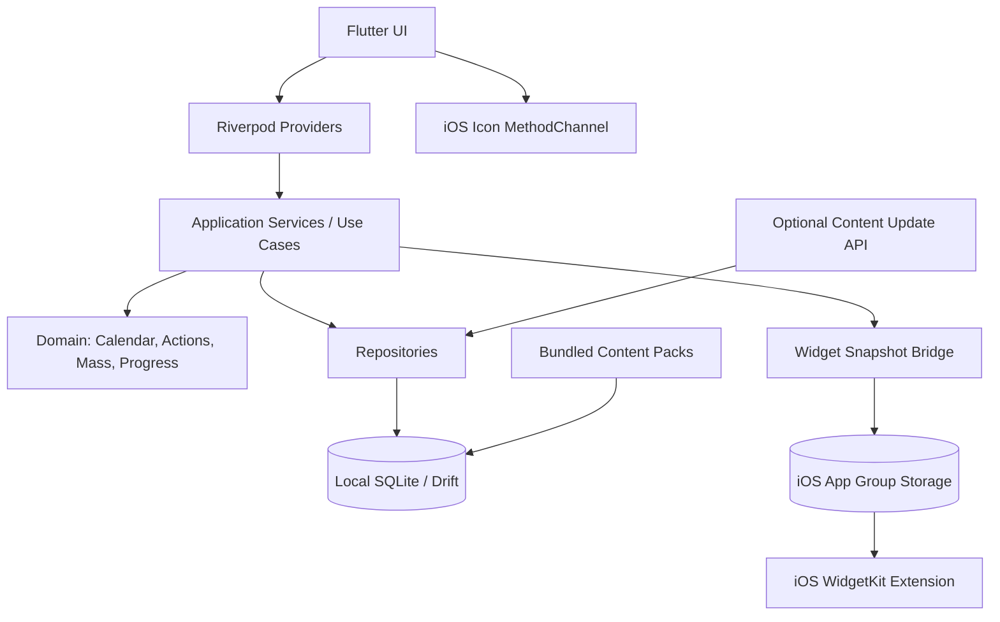
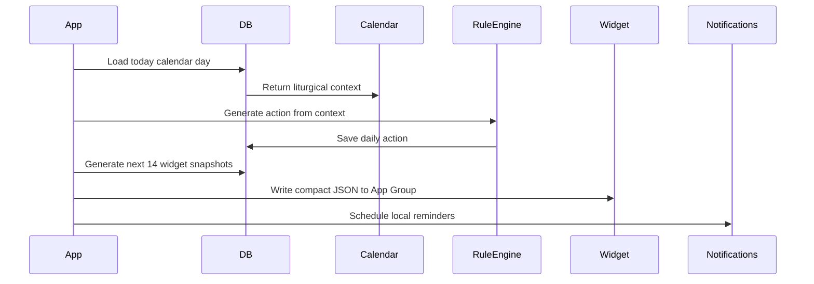

# Decision

**Yes, build it — but not as “Catholic calendar + Bible + church finder.”** That surface is already crowded. The existing Vietnamese app already covers liturgical calendar, feast days, daily Word of God, reflections, widgets, Bible, lunar/solar date conversion, Pope’s monthly prayer intentions, and church lists; global apps such as Laudate, Universalis, Liturgical, Sanctifica, Mass Time, and myParish already cover daily readings, Liturgy of the Hours, Rosary, devotions, church/Mass finding, widgets, parish events, and even habit/progress features. ([App Store](https://apps.apple.com/us/app/l%E1%BB%8Bch-c%C3%B4ng-gi%C3%A1o-2024-ph%E1%BB%A5ng-v%E1%BB%A5/id1663701849?utm_source=chatgpt.com "Lịch Công Giáo 2024 & Phụng Vụ - App Store - Apple"))

The product should be:

> **A local-first Catholic daily action app that turns the liturgical calendar into concrete daily practice.**

Working name: **Sống Đạo**  
Product category: **Catholic daily practice operating system**  
Not: “another Catholic reference app.”

---

# 1. Product positioning

## One-liner

**Sống Đạo helps Catholics live today’s faith through one clear daily action, liturgical context, reminders, private tracking, and a home-screen widget.**

## Core differentiation

Most Catholic apps answer:

> “What is today’s reading?”

This app answers:

> “What should I do today to live my faith?”

The calendar, readings, feast days, Mass schedules, and Bible content are **inputs**.  
The product is the **daily practice engine**.

---

# 2. PRD

## 2.1 Product goals

### Primary goal

Help users build a consistent Catholic daily rhythm.

### Secondary goals

Support offline usage, reduce dependence on opening the app, and surface the right Catholic action at the right time through widgets and reminders.

### Non-goals for MVP

Do **not** build a full Bible app, full breviary, social network, AI priest/confessor, livestream Mass platform, or public “faith score.” Those either create licensing complexity, pastoral risk, or direct competition with stronger existing apps.

---

# 3. Target users

## Persona 1 — Busy young Catholic

Age: 18–35  
Need: “I want to stay connected to faith daily, but I forget.”  
Value: one action per day, widget, reminders, streaks.

## Persona 2 — Parish-connected Vietnamese Catholic

Need: “I want to know today’s feast, readings, and important Masses.”  
Value: Vietnamese liturgical calendar, local parish Mass reminders, offline access.

## Persona 3 — Returning Catholic

Need: “I want structure without feeling judged.”  
Value: gentle daily actions, private journal, confession preparation checklist, no public ranking.

---

# 4. MVP feature set

## Feature 1 — Today screen

The Today screen is the app’s center.

It shows:

|Area|Content|
|---|---|
|Today header|Solar date, optional lunar date, liturgical season, color, feast/solemnity|
|Daily action|One recommended action: pray, read, attend, fast, serve, reflect|
|Reading references|First reading, psalm, gospel references|
|Reflection prompt|1 short question|
|Important Mass|Next Sunday/solemnity/local parish Mass|
|Completion|“I did this” button + optional private note|

The app must avoid becoming a content dump. The user should understand the day in under 10 seconds.

---

## Feature 2 — Daily Action Engine

This is the core moat.

### Action examples

|Liturgical context|Daily action|
|---|---|
|Ordinary weekday|“Read today’s Gospel and write one sentence.”|
|Friday|“Offer one small act of abstinence or sacrifice.”|
|Lent Friday|“No meat today. Choose one concrete sacrifice.”|
|Sunday|“Prepare for Mass: choose one intention before going.”|
|Advent|“Light/reflect on hope, peace, joy, or love.”|
|Solemnity|“Celebrate intentionally: attend Mass if applicable, pray the collect.”|
|Marian feast|“Pray one decade of the Rosary.”|
|Before confession|“Review your week privately for 5 minutes.”|

### Rule priority

1. Holy day / solemnity action
    
2. Sunday action
    
3. Liturgical season action
    
4. Local parish event action
    
5. Default weekday action
    

Example rule format:

```json
{
  "id": "lent_friday_abstinence",
  "priority": 90,
  "when": {
    "season": "lent",
    "weekday": "friday"
  },
  "action": {
    "title": "Practice abstinence today",
    "short_title": "Friday sacrifice",
    "duration_minutes": 5,
    "type": "fasting",
    "prompt": "Choose one small sacrifice and offer it for someone.",
    "proof_type": "self_check"
  }
}
```

---

## Feature 3 — Private practice tracking

Track completion privately.

Do **not** make it feel like a public virtue scoreboard.

Track:

|Metric|Purpose|
|---|---|
|Daily completion|Build rhythm|
|Weekly consistency|Encourage return|
|Sacramental reminders|Optional, private|
|Prayer streak|Gentle motivation|
|Notes|Personal reflection|

Recommended language:

- Good: “Your rhythm”
    
- Good: “This week’s practice”
    
- Avoid: “Faith score”
    
- Avoid: “Better Catholic ranking”
    
- Avoid: public proof unless user explicitly shares a card
    

---

## Feature 4 — Calendar

Calendar is still needed, but it is secondary.

Views:

|View|Purpose|
|---|---|
|Today|Main liturgical and action view|
|Week|Upcoming actions and important days|
|Month|Feast days, solemnities, Sundays|
|Search|Find saint, feast, reading reference, prayer|

MVP should support:

- Liturgical season
    
- Liturgical color
    
- Sundays
    
- Solemnities
    
- Memorials
    
- Feast days
    
- Optional Vietnamese lunar date
    
- Local calendar override by country/diocese later
    

---

## Feature 5 — Readings and Bible references

For MVP, I recommend showing **reading references first**, not full copyrighted text unless licensing is solved.

This matters because some official Catholic Bible/lectionary content requires permission or licensing for digital applications. For example, USCCB states that digital applications require a license/permission fee, while its free daily readings RSS allowance is limited to certain website use cases. ([USCCB](https://www.usccb.org/committees/divine-worship/policies/copyright-permissions-requirements?utm_source=chatgpt.com "Copyright Permission Requirements for the Use of ..."))

MVP-safe approach:

|Level|What to ship|
|---|---|
|MVP|Reading references, short public-domain excerpts where legally safe, links to official source|
|V1.1|Licensed Vietnamese readings/content pack|
|V2|Offline full Bible if translation license is secured or public-domain translation is used|

---

## Feature 6 — Church / Mass finder

MVP should not try to beat Google Maps.

Instead, build a **Catholic-specific parish directory**.

MVP fields:

|Field|Example|
|---|---|
|Church name|Giáo xứ Tân Định|
|Diocese|Tổng Giáo phận Sài Gòn|
|Address|Street, ward, city|
|Mass times|Sunday, weekday, feast day|
|Confession times|Optional|
|Phone / website|Optional|
|Last verified|Date|
|User correction|Suggest update|

Local-first approach:

- Ship a base parish database.
    
- Let user choose “My parish.”
    
- Cache nearby parishes after first use.
    
- Allow corrections, but review before publishing.
    

The app in the prompt already emphasizes Vietnamese dioceses/parishes/church lists, so this is not enough by itself; the unique angle is **“important Mass reminders + today’s action + my parish.”** ([Google Play](https://play.google.com/store/apps/details?hl=vi&id=com.daunut.lichconggiaovn&utm_source=chatgpt.com "Lịch Công Giáo 2024 & Phụng Vụ - Ứng dụng trên ..."))

---

## Feature 7 — iOS Widget

This should be the primary “dynamic surface.”

Apple’s WidgetKit is designed around timelines: the widget extension provides timeline entries, and WidgetKit uses them to update the widget at scheduled times. This fits daily Catholic content well: midnight date change, morning action, Sunday Mass countdown, and feast reminders. ([Apple Developer](https://developer.apple.com/documentation/widgetkit?utm_source=chatgpt.com "WidgetKit | Apple Developer Documentation"))

### Widget sizes

|Widget|Content|
|---|---|
|Small|Today date + liturgical color + daily action|
|Medium|Date + feast + action + Gospel reference|
|Large|Today action + important Mass + short reflection|
|Lock Screen|Date / feast / action short text|

### Widget examples

Small:

> Thứ Sáu Tuần II Mùa Chay  
> **Hy sinh hôm nay**  
> Cầu nguyện 5 phút

Medium:

> 27/02 — Mùa Chay  
> **Action:** Offer one sacrifice  
> **Gospel:** Mt 9:14–15  
> **Mass:** 18:00 — My parish

Large:

> Today: Friday of Lent  
> Action: No meat / one sacrifice  
> Reflection: “What attachment can I release today?”  
> Next important Mass: Sunday 07:00

---

## Feature 8 — Dynamic app icon

Use this only as a **secondary seasonal delight**, not the main dynamic surface.

Apple’s alternate app icon API changes the icon to the primary icon or one of the configured alternate icons; alternate icons must be configured in the app bundle/Xcode asset setup. That means it is suitable for predefined seasonal icons, not for rendering today’s date, daily action text, or Mass time. ([Apple Developer](https://developer.apple.com/documentation/uikit/uiapplication/setalternateiconname%28_%3Acompletionhandler%3A%29?utm_source=chatgpt.com "setAlternateIconName(_:completionHandler:)"))

Recommended alternate icons:

|Icon|Trigger|
|---|---|
|Default|Ordinary Time|
|Advent|Advent season|
|Christmas|Christmas season|
|Lent|Lent|
|Easter|Easter season|
|Marian|Optional user-selected icon|
|Minimal|Optional aesthetic icon|

Implementation rule:

- Ask user to opt in.
    
- Change only when app is open.
    
- Do not rely on icon for daily changing information.
    
- Put daily dynamic info in WidgetKit.
    

---

# 5. MVP user stories

## Daily action

As a Catholic user, I want to open the app and immediately know one thing I should do today, so that I can practice my faith without browsing.

Acceptance criteria:

- Today screen loads offline.
    
- Shows one primary action.
    
- Action can be completed with one tap.
    
- Optional note is stored locally.
    
- Completion affects weekly rhythm.
    

---

## Widget

As a user, I want my home screen to show today’s Catholic action, so that I remember without opening the app.

Acceptance criteria:

- Widget shows today’s date and action.
    
- Widget updates at day boundary using timeline data.
    
- Widget opens directly to Today screen.
    
- If no data is available, widget shows a graceful fallback.
    

---

## Important Mass

As a user, I want to know the next important Mass, especially Sunday or solemnity Mass, so that I can plan ahead.

Acceptance criteria:

- If user selects a parish, show next Mass from that parish.
    
- If no parish selected, show “Choose your parish.”
    
- Sundays and solemnities are prioritized.
    
- Mass data is available offline after parish data is downloaded/imported.
    

---

## Local-first

As a user, I want the app to work without internet, so that I can use it in church or while traveling.

Acceptance criteria:

- App opens offline.
    
- Today action loads offline.
    
- Calendar loads offline.
    
- Previously downloaded parish data loads offline.
    
- Completion and notes are stored locally first.
    

Flutter’s own architecture guidance explicitly covers offline-first apps, and Drift is a strong fit here because it provides reactive SQLite persistence for Flutter/Dart apps. ([Flutter Documentation](https://docs.flutter.dev/app-architecture/design-patterns/offline-first?utm_source=chatgpt.com "Offline-first support"))

---

# 6. Product architecture

## 6.1 High-level architecture



## 6.2 Architectural principle

**The local database is the source of truth.**

The server, if added later, only provides:

- Content pack updates
    
- Parish data corrections
    
- Optional encrypted backup
    
- Optional analytics, opt-in only
    

The app must not need a server to show today’s action.

---

# 7. Recommended Flutter stack

|Area|Recommendation|
|---|---|
|App|Flutter|
|State management|Riverpod|
|Navigation|go_router|
|Local DB|Drift + SQLite|
|Search|SQLite FTS5 for Bible/prayer/church search|
|Immutable models|freezed + json_serializable|
|Notifications|flutter_local_notifications + timezone|
|Widget bridge|home_widget or custom MethodChannel|
|iOS widget UI|Native SwiftUI WidgetKit|
|App icon bridge|Swift MethodChannel|
|Content updates|Signed JSON/SQLite content packs|
|Optional sync|REST or Supabase later, not required for MVP|

The `home_widget` package can help pass data from Flutter to iOS/Android widgets, but it does not let you write the widget UI itself in Flutter; the iOS widget still needs native WidgetKit/SwiftUI code. Flutter also supports adding iOS app extension targets, and platform channels are the standard way to call platform-specific iOS/Android code from Dart. ([Dart packages](https://pub.dev/packages/home_widget?utm_source=chatgpt.com "home_widget | Flutter package"))

---

# 8. Flutter project structure

```txt
lib/
  main.dart
  app/
    app.dart
    router.dart
    theme.dart
    localization.dart

  core/
    error/
    logging/
    time/
    permissions/
    result.dart

  data/
    db/
      app_database.dart
      tables/
        calendar_days.dart
        celebrations.dart
        readings.dart
        actions.dart
        action_logs.dart
        churches.dart
        mass_times.dart
        user_settings.dart
        widget_snapshots.dart
        sync_queue.dart
      daos/
        calendar_dao.dart
        action_dao.dart
        church_dao.dart
        widget_snapshot_dao.dart
    seed/
      seed_importer.dart
      content_pack_reader.dart
    sync/
      content_manifest_client.dart
      content_pack_sync_service.dart

  domain/
    calendar/
      liturgical_day.dart
      liturgical_rank.dart
      liturgical_season.dart
    action/
      daily_action.dart
      action_rule.dart
      action_engine.dart
      action_completion.dart
    church/
      church.dart
      mass_time.dart
      important_mass_service.dart
    progress/
      practice_rhythm.dart

  features/
    today/
      today_screen.dart
      today_controller.dart
      today_state.dart
    calendar/
      calendar_screen.dart
      calendar_controller.dart
    actions/
      action_detail_screen.dart
      action_completion_sheet.dart
    readings/
      readings_screen.dart
      reading_reference_card.dart
    church_finder/
      church_search_screen.dart
      church_detail_screen.dart
      parish_selector.dart
    prayer/
      prayer_library_screen.dart
    progress/
      progress_screen.dart
      weekly_review_screen.dart
    settings/
      settings_screen.dart
      widget_settings_screen.dart
      icon_settings_screen.dart

  platform/
    widget/
      widget_snapshot_service.dart
      widget_bridge.dart
    icon/
      app_icon_service.dart
```

Native iOS:

```txt
ios/
  Runner/
    AppDelegate.swift
    IconChannel.swift

  DailyActionWidgetExtension/
    DailyActionWidget.swift
    DailyActionEntry.swift
    DailyActionProvider.swift
    WidgetViews/
      SmallWidgetView.swift
      MediumWidgetView.swift
      LargeWidgetView.swift
```

---

# 9. Local database schema

## calendar_days

```sql
calendar_days (
  date TEXT PRIMARY KEY,
  solar_date TEXT NOT NULL,
  lunar_date TEXT,
  weekday INTEGER NOT NULL,
  liturgical_season TEXT NOT NULL,
  liturgical_week INTEGER,
  liturgical_color TEXT,
  cycle_year TEXT,
  psalter_week INTEGER,
  locale TEXT NOT NULL,
  generated_at TEXT NOT NULL
)
```

## celebrations

```sql
celebrations (
  id TEXT PRIMARY KEY,
  date TEXT NOT NULL,
  title TEXT NOT NULL,
  rank TEXT NOT NULL,
  liturgical_color TEXT,
  is_solemnity INTEGER NOT NULL DEFAULT 0,
  is_holy_day_obligation INTEGER NOT NULL DEFAULT 0,
  is_sunday INTEGER NOT NULL DEFAULT 0,
  locale TEXT NOT NULL,
  source TEXT,
  UNIQUE(date, title, locale)
)
```

## readings

```sql
readings (
  id TEXT PRIMARY KEY,
  date TEXT NOT NULL,
  type TEXT NOT NULL,
  citation TEXT NOT NULL,
  short_label TEXT,
  text TEXT,
  text_license TEXT,
  source_url TEXT,
  locale TEXT NOT NULL
)
```

For MVP, `text` can be nullable. Store references safely first.

## action_rules

```sql
action_rules (
  id TEXT PRIMARY KEY,
  priority INTEGER NOT NULL,
  rule_json TEXT NOT NULL,
  action_template_json TEXT NOT NULL,
  locale TEXT NOT NULL,
  enabled INTEGER NOT NULL DEFAULT 1
)
```

## daily_actions

```sql
daily_actions (
  id TEXT PRIMARY KEY,
  date TEXT NOT NULL,
  title TEXT NOT NULL,
  short_title TEXT NOT NULL,
  description TEXT,
  prompt TEXT,
  type TEXT NOT NULL,
  duration_minutes INTEGER,
  source_rule_id TEXT,
  priority INTEGER NOT NULL,
  locale TEXT NOT NULL,
  created_at TEXT NOT NULL,
  UNIQUE(date, source_rule_id, locale)
)
```

## action_logs

```sql
action_logs (
  id TEXT PRIMARY KEY,
  daily_action_id TEXT NOT NULL,
  date TEXT NOT NULL,
  status TEXT NOT NULL,
  completed_at TEXT,
  note TEXT,
  proof_type TEXT NOT NULL DEFAULT 'self_check',
  proof_data_hash TEXT,
  created_at TEXT NOT NULL,
  updated_at TEXT NOT NULL,
  synced_at TEXT
)
```

## churches

```sql
churches (
  id TEXT PRIMARY KEY,
  name TEXT NOT NULL,
  diocese TEXT,
  deanery TEXT,
  parish TEXT,
  address TEXT,
  city TEXT,
  country TEXT,
  latitude REAL,
  longitude REAL,
  phone TEXT,
  website TEXT,
  source TEXT,
  verified_at TEXT,
  updated_at TEXT NOT NULL
)
```

## mass_times

```sql
mass_times (
  id TEXT PRIMARY KEY,
  church_id TEXT NOT NULL,
  weekday INTEGER,
  liturgical_context TEXT,
  time_local TEXT NOT NULL,
  language TEXT,
  note TEXT,
  valid_from TEXT,
  valid_until TEXT,
  updated_at TEXT NOT NULL
)
```

## user_settings

```sql
user_settings (
  id TEXT PRIMARY KEY,
  locale TEXT NOT NULL DEFAULT 'vi',
  country_calendar TEXT DEFAULT 'VN',
  selected_church_id TEXT,
  morning_reminder_time TEXT DEFAULT '06:30',
  evening_review_time TEXT DEFAULT '21:30',
  widget_enabled INTEGER NOT NULL DEFAULT 1,
  seasonal_icon_enabled INTEGER NOT NULL DEFAULT 0,
  analytics_opt_in INTEGER NOT NULL DEFAULT 0,
  location_opt_in INTEGER NOT NULL DEFAULT 0
)
```

## widget_snapshots

```sql
widget_snapshots (
  date TEXT PRIMARY KEY,
  payload_json TEXT NOT NULL,
  generated_at TEXT NOT NULL
)
```

---

# 10. Daily action generation flow



Generation should happen:

- On first launch
    
- At app open if date changed
    
- After content pack update
    
- After user changes parish
    
- After user changes notification/widget settings
    

---

# 11. iOS Widget architecture

## Recommended implementation

Use:

- Flutter for the main app
    
- SwiftUI WidgetKit extension for widget UI
    
- App Group shared storage for widget payload
    
- `home_widget` or custom MethodChannel to write data
    
- Widget timelines for daily updates
    

Apple App Groups are intended for sharing data between an app and extensions, which is exactly the app-widget case. ([Apple Developer](https://developer.apple.com/documentation/Xcode/configuring-app-groups?utm_source=chatgpt.com "Configuring app groups | Apple Developer Documentation"))

## Widget snapshot payload

The Flutter app writes a compact JSON payload:

```json
{
  "date": "2026-04-27",
  "display_date": "Thứ Hai, 27/04",
  "lunar_date": "11/03 ÂL",
  "season": "Mùa Phục Sinh",
  "color": "white",
  "celebration": "Thứ Hai Tuần IV Phục Sinh",
  "daily_action": {
    "title": "Cầu nguyện 5 phút",
    "short_title": "Cầu nguyện hôm nay",
    "prompt": "Xin Chúa chỉ cho bạn một người cần được yêu thương hôm nay."
  },
  "gospel_ref": "Ga 10,1-10",
  "important_mass": {
    "label": "Chúa Nhật tới",
    "time": "07:00",
    "church": "Giáo xứ đã chọn"
  },
  "deep_link": "songdao://today?date=2026-04-27"
}
```

## Widget update strategy

The app should pre-generate snapshots for the next 7–14 days.

WidgetKit reads those snapshots and creates timeline entries:

```swift
struct DailyActionEntry: TimelineEntry {
    let date: Date
    let displayDate: String
    let season: String
    let celebration: String
    let actionTitle: String
    let gospelRef: String
    let importantMass: String?
}
```

Timeline policy:

- Entry at midnight for each day
    
- Optional entry 1–2 hours before important Mass
    
- Reload when the app updates parish or content pack
    

Apple’s `WidgetCenter` API can be used to request timeline reloads when app state changes. ([Apple Developer](https://developer.apple.com/documentation/widgetkit/widgetcenter?utm_source=chatgpt.com "WidgetCenter | Apple Developer Documentation"))

---

# 12. Dynamic app icon architecture

## Flutter API

```dart
abstract class AppIconService {
  Future<bool> supportsAlternateIcons();
  Future<void> setIcon(AppIconVariant variant);
  Future<AppIconVariant> getCurrentIcon();
}
```

## Variants

```dart
enum AppIconVariant {
  primary,
  advent,
  christmas,
  lent,
  easter,
  ordinary,
  marian,
  minimal,
}
```

## Swift bridge

```swift
import UIKit
import Flutter

final class IconChannel {
    static func register(with messenger: FlutterBinaryMessenger) {
        let channel = FlutterMethodChannel(
            name: "app.songdao/icon",
            binaryMessenger: messenger
        )

        channel.setMethodCallHandler { call, result in
            switch call.method {
            case "supportsAlternateIcons":
                result(UIApplication.shared.supportsAlternateIcons)

            case "setIcon":
                guard
                    let args = call.arguments as? [String: Any],
                    let iconName = args["iconName"] as? String
                else {
                    result(FlutterError(code: "BAD_ARGS", message: "Missing iconName", details: nil))
                    return
                }

                let resolvedName = iconName == "primary" ? nil : iconName

                UIApplication.shared.setAlternateIconName(resolvedName) { error in
                    if let error = error {
                        result(FlutterError(code: "ICON_ERROR", message: error.localizedDescription, details: nil))
                    } else {
                        result(nil)
                    }
                }

            default:
                result(FlutterMethodNotImplemented)
            }
        }
    }
}
```

## Product rule

Do **not** promise “daily changing icon with date/action.”  
Promise:

> “Seasonal Catholic app icons.”

Use the widget for dynamic daily content.

---

# 13. Notifications

Use local notifications, not server push, for MVP.

The Flutter local notifications plugin supports displaying and scheduling local notifications across platforms. ([Dart packages](https://pub.dev/packages/flutter_local_notifications?utm_source=chatgpt.com "flutter_local_notifications | Flutter package"))

## Notification types

|Notification|Default|
|---|---|
|Morning action|06:30|
|Evening review|21:30|
|Sunday Mass reminder|User-configured|
|Solemnity reminder|Previous evening|
|Lent Friday reminder|Morning|
|Parish Mass reminder|Optional|

## Notification copy examples

Vietnamese:

- “Hôm nay: một việc nhỏ để sống đức tin.”
    
- “Bạn đã hoàn thành việc thiêng liêng hôm nay chưa?”
    
- “Chúa Nhật: chuẩn bị một ý cầu nguyện trước Thánh lễ.”
    
- “Thứ Sáu Mùa Chay: chọn một hy sinh nhỏ hôm nay.”
    

English:

- “One small act of faith for today.”
    
- “Have you completed today’s practice?”
    
- “Sunday Mass: prepare one intention.”
    
- “Friday of Lent: choose one sacrifice today.”
    

---

# 14. Content pack architecture

## Why content packs?

Local-first apps still need updated calendars, feast data, parish data, and corrected Mass times.

## Pack types

|Pack|Contents|
|---|---|
|`calendar-vn-2026`|Liturgical days, seasons, solemnities|
|`readings-refs-vi-2026`|Reading references|
|`actions-vi-core`|Daily action rules|
|`prayers-vi-core`|Public/licensed prayers|
|`churches-vn-base`|Parish directory|
|`mass-times-vn-delta`|Updated Mass schedules|

## Manifest example

```json
{
  "version": "2026.04.27",
  "packs": [
    {
      "id": "calendar-vn-2026",
      "version": "1.0.3",
      "url": "https://cdn.example.com/packs/calendar-vn-2026.sqlite.zst",
      "sha256": "abc123",
      "required": true
    },
    {
      "id": "actions-vi-core",
      "version": "1.2.0",
      "url": "https://cdn.example.com/packs/actions-vi-core.json",
      "sha256": "def456",
      "required": true
    }
  ]
}
```

## Import rules

- Verify checksum.
    
- Import inside DB transaction.
    
- Keep previous pack until import succeeds.
    
- Regenerate next 14 days of daily actions.
    
- Regenerate widget snapshots.
    
- Reschedule notifications.
    

---

# 15. Privacy architecture

This app handles religious practice data, which is sensitive.

## MVP privacy rules

|Area|Rule|
|---|---|
|Account|No account required|
|Practice logs|Local only by default|
|Notes|Local only|
|Location|Ask only when using nearby church search|
|Analytics|Opt-in only|
|Sync|Optional and encrypted later|
|Public sharing|User-initiated only|
|Confession prep|Never upload private notes|

## Avoid

- Public leaderboards
    
- Parish surveillance
    
- “Proof of Mass attendance” as default
    
- Location-based attendance verification without explicit consent
    
- AI confession claims
    

Recommended wording:

> “Your practice history stays on your device unless you choose backup.”

---

# 16. Feature roadmap

## MVP — 4 to 6 weeks

Build:

- Today screen
    
- Daily Action Engine
    
- Local Drift database
    
- Vietnamese liturgical calendar seed
    
- Reading references
    
- Completion tracking
    
- iOS WidgetKit widget
    
- Local notifications
    
- Seasonal app icon setting
    
- Basic parish selection
    

Do not build:

- Full Bible
    
- Full church map
    
- Social features
    
- AI
    
- Account system
    
- Payment
    

---

## V1 — 8 to 10 weeks

Add:

- Church finder search
    
- My parish Mass times
    
- Feast/solemnity reminders
    
- Weekly review
    
- Prayer library
    
- Widget customization
    
- Content pack update system
    
- Import parish correction data
    

---

## V2

Add:

- Optional encrypted backup
    
- Family mode
    
- Parish announcements
    
- Licensed readings/full Bible
    
- Audio prayers
    
- Offline map areas
    
- Calendar export
    
- Apple Watch complications
    
- Android widgets
    

---

# 17. MVP screen map

```txt
Bottom Navigation
  1. Today
  2. Calendar
  3. Pray
  4. Church
  5. Progress

Today
  - Liturgical date card
  - Daily action card
  - Gospel/reference card
  - Important Mass card
  - Complete action
  - Private note

Calendar
  - Week view
  - Month view
  - Feast detail
  - Action preview

Pray
  - Daily prayer
  - Rosary
  - Confession preparation
  - Common prayers
  - Saved prayers

Church
  - My parish
  - Nearby/search
  - Mass times
  - Suggest correction

Progress
  - This week
  - Completed actions
  - Notes
  - Review
  - Settings shortcut
```

---

# 18. Widget-first UX

The widget should be treated as a first-class product surface, not a bonus.

## Widget taps

|Widget area|Deep link|
|---|---|
|Daily action|`songdao://today/action`|
|Mass|`songdao://church/mass`|
|Reading ref|`songdao://readings/today`|
|Date/feast|`songdao://calendar/today`|

## Widget states

|State|UI|
|---|---|
|Normal|Today + action|
|Completed|Checkmark + evening reflection|
|Sunday|Mass-focused|
|Solemnity|Celebration-focused|
|No parish|“Choose parish for Mass reminders”|
|No data|“Open Sống Đạo to prepare today”|

---

# 19. Engineering milestones

## Milestone 0 — Product/legal foundation

Duration: 3–5 days

Deliverables:

- Final MVP scope
    
- Content licensing decision
    
- Seed data format
    
- Liturgical calendar rules
    
- App name + bundle ID
    
- Widget design wireframes
    

Exit criteria:

- You know exactly what content is legally safe to ship.
    
- You have one year of calendar seed data or a generation plan.
    

---

## Milestone 1 — Local-first core

Duration: 1 week

Deliverables:

- Flutter project scaffold
    
- Drift database
    
- Seed importer
    
- Today screen
    
- Calendar day model
    
- Daily action rules
    
- Completion logging
    

Exit criteria:

- App works in airplane mode.
    
- Today screen shows action from local DB.
    
- Completion persists after restart.
    

---

## Milestone 2 — Widget + notifications

Duration: 1 week

Deliverables:

- iOS Widget Extension
    
- App Group storage
    
- Widget snapshot service
    
- Small/medium widgets
    
- Local notifications
    
- Deep links
    

Exit criteria:

- Widget shows today’s action.
    
- Widget opens Today screen.
    
- Notification opens the right action.
    
- Widget handles missing data gracefully.
    

---

## Milestone 3 — Parish / Mass MVP

Duration: 1 week

Deliverables:

- Church tables
    
- Parish selector
    
- Manual parish search
    
- Mass time display
    
- Important Mass logic
    
- Widget Mass field
    

Exit criteria:

- User can select parish.
    
- App shows next important Mass.
    
- Widget shows Mass if available.
    

---

## Milestone 4 — Polish beta

Duration: 1–2 weeks

Deliverables:

- Progress screen
    
- Prayer basics
    
- Settings
    
- Seasonal app icons
    
- Onboarding
    
- Vietnamese copy polish
    
- TestFlight beta
    

Exit criteria:

- 20–50 beta users can use it for one week without network dependency.
    
- You can measure completion rate locally or via opt-in analytics.
    

---

# 20. Key technical risks

|Risk|Severity|Mitigation|
|---|--:|---|
|Copyright/licensing for readings|High|Start with references + licensed/public-domain content only|
|Widget refresh expectations|Medium|Use WidgetKit timelines; do not promise live updates|
|Dynamic icon misuse|Medium|Use only predefined seasonal icons|
|Parish/Mass data staleness|High|Add “last verified” and correction workflow|
|Over-gamifying faith|High|Private rhythm, no public ranking|
|Local DB migration complexity|Medium|Version all content packs and migrations|
|App becoming too broad|High|Keep Today/action as the center|

---

# 21. Final product recommendation

Build **Sống Đạo** only if the MVP is this:

> **Every day, the user receives one Catholic action, sees today’s liturgical context, gets reminded through an iOS widget, and privately builds a rhythm of practice — all local-first.**

Do **not** lead with:

- Calendar
    
- Bible
    
- Church finder
    
- Reflections
    
- Saints database
    

Those are supporting modules.

Lead with:

- **Today**
    
- **One action**
    
- **My parish**
    
- **Important Mass**
    
- **Private rhythm**
    
- **Widget-first reminders**
    

That is different enough to justify building.