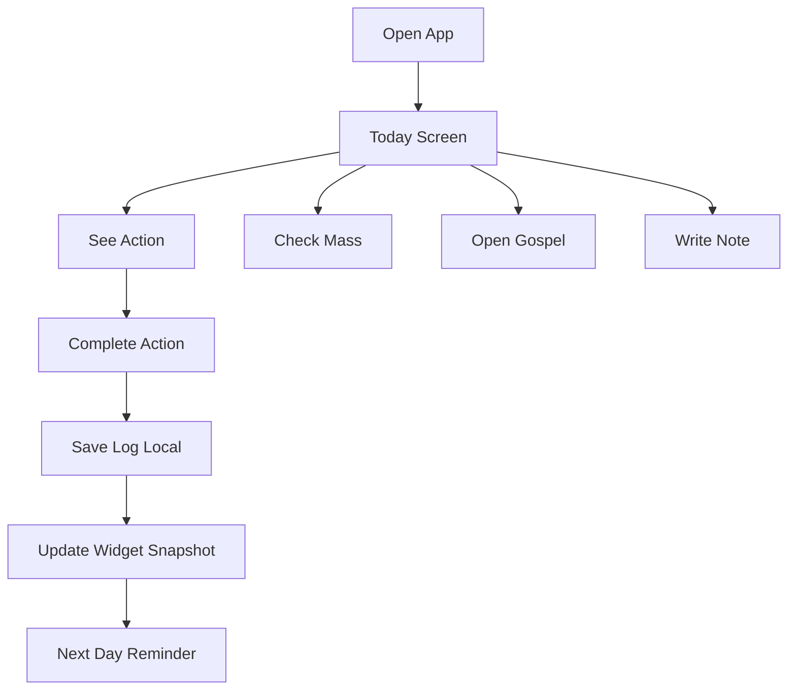

# 🧩 Sống Đạo — Figma Text-Based Wireframe (MVP)


# 1. 🧠 Design System (Foundation)

## Frame setup (Figma)

```
Device: iPhone 14
Frame: 390 x 844
Grid: 4pt
Margins: 16
Columns: 4
```

## Typography

```
H1: 24 / Bold
H2: 20 / Semibold
Body: 16 / Regular
Caption: 12 / Medium
Button: 16 / Semibold
```

## Color tokens

```
Primary: #0B5FFF
Liturgical:
  Green: #2E7D32
  Purple: #6A1B9A
  Red: #C62828
  White: #F5F5F5
  Gold: #C9A227
Background: #FFFFFF
Surface: #F7F7F7
Text: #111111
Muted: #888888
```

---

# 2. 🏠 TODAY SCREEN (CORE MVP)

## Frame: `Today / Default`

```
[Status Bar]

[Header]
  Text: "Thứ Hai, 27/04"
  Sub: "Mùa Phục Sinh · Trắng"

--------------------------------

[Card: Daily Action] (Primary)
  Title: "Việc hôm nay"
  Action: "Cầu nguyện 5 phút"
  Prompt:
    "Xin Chúa chỉ cho bạn một người cần được yêu thương hôm nay."

  [Button Primary]
    Label: "Đã làm xong"

  [Button Secondary]
    Label: "Viết ghi chú"

--------------------------------

[Card: Gospel]
  Label: "Tin Mừng"
  Text: "Ga 10,1-10"
  [Button] "Xem thêm"

--------------------------------

[Card: Important Mass]
  Label: "Thánh lễ quan trọng"
  Text: "Chúa Nhật · 07:00"
  Sub: "Giáo xứ Tân Định"

--------------------------------

[Bottom Nav]
  Today | Calendar | Pray | Church | Progress
```

---

## State: `Completed`

```
[Card: Daily Action]
  ✔ "Bạn đã hoàn thành hôm nay"

  [Button]
    "Viết suy niệm"
```

---

## State: `No Parish`

```
[Card: Important Mass]
  Text: "Chọn giáo xứ để xem giờ lễ"
  [Button] "Chọn ngay"
```

---

# 3. 📅 CALENDAR SCREEN

## Frame: `Calendar / Month`

```
[Header]
  "Tháng 4, 2026"

[Month Grid]
  1  2  3  4
  5  6  7  8 ...

  - Sunday highlighted
  - Solemnity: gold dot
  - Feast: small dot

--------------------------------

[Selected Day Detail]
  Title: "27/04"
  Sub: "Thứ Hai Tuần IV Phục Sinh"

  Action Preview:
    "Cầu nguyện 5 phút"

  Gospel:
    "Ga 10,1-10"
```

---

# 4. 🙏 PRAY SCREEN

## Frame: `Pray / List`

```
[Header]
  "Cầu nguyện"

[List]
  - Kinh Lạy Cha
  - Kinh Kính Mừng
  - Kinh Sáng Danh
  - Mân Côi
  - Xét mình

--------------------------------

[Quick Action]
  "Cầu nguyện hôm nay (5 phút)"
```

---

# 5. ⛪ CHURCH SCREEN

## Frame: `Church / My Parish`

```
[Header]
  "Giáo xứ của tôi"

[Card]
  Name: "Giáo xứ Tân Định"
  Address: "Q.3, TP.HCM"

--------------------------------

[Mass Times]
  Sunday:
    05:00
    07:00
    18:00

  Weekday:
    05:30
    17:30

--------------------------------

[Button]
  "Đổi giáo xứ"
```

---

## Frame: `Church / Search`

```
[Search Bar]
  "Tìm giáo xứ..."

[List Results]
  - Giáo xứ A
  - Giáo xứ B
```

---

# 6. 📊 PROGRESS SCREEN

## Frame: `Progress / Weekly`

```
[Header]
  "Tuần này"

[Graph]
  Mon ✔
  Tue ✔
  Wed ✖
  Thu ✔

--------------------------------

[Stats]
  Completed: 4/7
  Streak: 3 ngày

--------------------------------

[Notes]
  "Bạn đã viết 2 ghi chú"
```

---

# 7. ⚙️ SETTINGS SCREEN

```
[Section]
  Parish
    → Giáo xứ đã chọn

  Notifications
    → 06:30 sáng
    → 21:30 tối

  Widget
    → Bật / Tắt

  App Icon
    → Mùa Phục Sinh

  Language
    → Vietnamese
```

---

# 8. 📱 WIDGET WIREFRAMES (KEY DIFFERENTIATOR)

## Small Widget

```
[Date]
27/04

[Action]
Cầu nguyện hôm nay

[Season Color Bar]
```

---

## Medium Widget

```
[Date + Season]
27/04 · Mùa Phục Sinh

[Action]
Cầu nguyện 5 phút

[Gospel]
Ga 10,1-10
```

---

## Large Widget

```
[Date + Feast]
Thứ Hai · Phục Sinh

[Action]
Cầu nguyện 5 phút

[Prompt]
"Yêu thương một người hôm nay"

[Mass]
Chúa Nhật · 07:00
```

---

# 9. 🔁 FLOW (User Journey)



---

# 10. ⚡ Key UX Principles (Enforced)

## 1. 10-second clarity

User must understand:

* Today is what?
* What should I do?

## 2. Single primary action

Never show:

* 5 actions
* 10 prayers
* long feed

## 3. Widget-first

App = fallback
Widget = daily surface

## 4. Private by default

No:

* leaderboard
* social feed

---

# 11. 🚀 What to Build First (Figma → Dev)

## Priority order

1. Today screen (100%)
2. Widget layout (small + medium)
3. Action card component
4. Parish card
5. Calendar (basic)
6. Progress (simple)

---

# 12. 🔧 Mapping to Your Architecture

This wireframe directly maps to your system:

* `TodayScreen` → `daily_actions + calendar_days`
* `Widget` → `widget_snapshots`
* `Mass card` → `churches + mass_times`
* `Progress` → `action_logs`

---

# 13. 📌 Critical Execution Insight

This is NOT a UI-heavy app.

It’s a **decision engine UI**:

```
Liturgical Data → Rule Engine → ONE Action → Widget → Habit
```

If UI becomes content-heavy → you lose differentiation.

---

