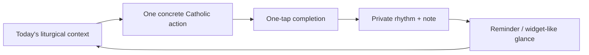

# Sống Đạo Lovable PRD

## 1. Insight

Sống Đạo should not compete as another Catholic calendar, Bible reader, or church directory. Those categories are crowded and content/licensing heavy. The product wedge is smaller and sharper:

> Một việc nhỏ mỗi ngày để sống đức tin.

The core job is to answer: "What should I do today to live my faith?"

Calendar data, feast days, reading references, prayers, parish/Mass data, reminders, and progress are inputs into one retention loop:



## 2. Decision

Build the Lovable version as a polished local-first PWA prototype, not a full native Flutter replacement.

Lovable should ship the web/PWA MVP that validates activation and retention:

- User opens the app and understands today's faith action in under 10 seconds.
- User completes the action with one tap.
- User can save a private reflection note.
- User can see reading references without copyrighted full text.
- User can choose a parish and see the next important Mass.
- User can see a gentle private weekly rhythm.

Do not build accounts, payment, social features, AI confession, livestreaming, public rankings, or a full Bible.

## 3. Product Context

Brand name: `Sống Đạo`

Category: Catholic daily practice companion.

One-liner:

> Sống Đạo helps Catholics live today's faith through one clear daily action, liturgical context, reminders, private tracking, and a home-screen/widget-like glance.

Primary language: Vietnamese.

Secondary language: English can exist later, but do not spend MVP scope on full bilingual support.

Privacy posture:

> Your practice history stays on your device unless you choose backup.

## 4. Target Users

### Busy Young Catholic

Need: "I want to stay connected to faith daily, but I forget."

MVP value: one action, reminder, one-tap completion, private weekly rhythm.

### Parish-Connected Vietnamese Catholic

Need: "I want today's feast, readings, and important Masses."

MVP value: Vietnamese liturgical context, optional lunar date, selected parish, next important Mass.

### Returning Catholic

Need: "I want structure without being judged."

MVP value: gentle daily practice, private notes, no scoring, no shame copy.

## 5. MVP Scope

### Must Build

1. Today screen
2. Daily Action Engine
3. Completion logging
4. Private reflection note
5. Calendar/week rhythm
6. Reading references only
7. Prayer basics/library
8. Parish selector and Important Mass card
9. Progress screen with private rhythm
10. Settings/privacy screen
11. Landing page separated from the app
12. Local-first persistence
13. Export/import backup JSON

### Must Not Build

- Full Bible
- Full breviary
- Social feed
- AI priest/confessor
- Public faith score
- Account system
- Payment
- Livestream Mass
- Google Maps replacement
- Attendance proof
- Supabase dependency for core app open/use

## 6. Current Project Review

### What Already Works

The repo has two mature directions:

- Flutter app under `/songdao`: Drift-backed local database, content-pack importer, Today screen, completion logs, notifications, iOS WidgetKit bridge, church/Mass logic, tests.
- Next/PWA under `/songdao-web`: usable web prototype with routes for Today, Calendar, Pray, Progress, Settings, localStorage persistence, content packs, action engine, desktop dashboard, and mobile layout.

The current webapp already proves the product loop:

- `/today/[date]` loads the date-specific daily view.
- `src/lib/content.ts` imports bundled calendar content packs.
- `src/lib/engine.ts` selects the daily action.
- `src/lib/storage.ts` stores completion logs, settings, notes, and backup JSON locally.
- `src/lib/views.ts` composes screen view models.

### Main Gap

The current webapp is functionally strong but visually diverges from the updated Open Design theme. It is still closer to the older green chapel-card UI and newer desktop dashboard work.

For Lovable, preserve the webapp's logic but adopt the updated visual system from:

`/Users/dantong/Projects/Mobile-Apps/SongDao/graphics-design/Song-Dao-Open-Design`

Key updated design signals:

- Warm paper background: `#f5f4ed`
- Surface: `#faf9f5`
- Warm surface: `#e8e6dc`
- Ink text: `#141413`
- Muted text: `#5e5d59`
- Terracotta accent: `#c96442`
- Display serif for major headings
- Calm rounded cards, subtle borders, no heavy shadows
- Screen-file-first structure: landing, today, practice, calendar, parish, progress as separate routes

## 7. Core User Stories

### Today

As a Catholic user, I want one clear action for today so I know how to live my faith without sorting through content.

Acceptance criteria:

- Shows date, liturgical season, color, optional lunar date, and primary celebration.
- Shows one primary action above reading references.
- Shows completion CTA.
- After completion, CTA becomes completed state and note is available.
- Works offline after first load.
- Does not show full Bible text unless a legally safe content source is explicitly included.

### Practice Engine

As a user, I want today's action to adapt to the liturgical day so it feels relevant.

Acceptance criteria:

- Rule priority: holy day/solemnity, Sunday, feast, season, parish event, weekday, fallback.
- Friday action is sacrifice/service oriented.
- Sunday action is Mass/intention oriented.
- Lent actions are penance/sacrifice oriented.
- Easter actions are gratitude/witness oriented.
- Unknown dates fall back to a gentle prayer action.

### Progress

As a user, I want to see my rhythm privately so I feel encouraged without being judged.

Acceptance criteria:

- Shows current week completion count.
- Shows completed days.
- Shows recent completed actions.
- Avoids words like score, rank, fail, proof, streak pressure.
- Notes and logs remain local.

### Parish

As a parish-connected user, I want to choose my parish and see the next important Mass.

Acceptance criteria:

- User can pick from a small seeded parish list.
- Selected parish persists locally.
- Shows next Sunday/important Mass if available.
- Shows last verified/stale state honestly.
- Does not require live location.

### Landing

As a new user, I want to understand the app promise quickly.

Acceptance criteria:

- Landing page is separate from app screens.
- Hero shows the product UI, not abstract religious marketing.
- Headline communicates daily practice, not content library.
- CTA opens Today.
- Mentions privacy/local-first and Vietnamese Catholic focus.

## 8. Screens

Use these routes in Lovable:

| Route | Purpose |
|---|---|
| `/` | Landing page |
| `/today` | Redirects or loads today's date |
| `/today/:date` | Primary daily practice screen |
| `/practice` | Daily Action Engine explanation/control surface |
| `/calendar` | Calendar/week view, secondary |
| `/parish` | Parish selector and Important Mass |
| `/pray` | Prayer basics/library |
| `/progress` | Private rhythm and recent notes |
| `/settings` | Privacy, reminder preference, backup/import |

## 9. Data Model

For Lovable MVP, use local browser persistence first. If Supabase is added, it must be optional and never block Today.

Recommended local entities:

```ts
type CalendarDay = {
  id: string;
  date: string;
  locale: "vi";
  season: string;
  liturgicalWeek: string;
  liturgicalColor: string;
  cycleYear?: string;
  lunarDate?: string;
  weekday: string;
  isSunday: boolean;
};

type Celebration = {
  id: string;
  date: string;
  title: string;
  rank: "weekday" | "memorial" | "feast" | "solemnity" | "holy_day" | "sunday";
  isSolemnity: boolean;
  isHolyDay: boolean;
  isSunday: boolean;
};

type Reading = {
  id: string;
  date: string;
  type: "first" | "psalm" | "second" | "alleluia" | "gospel";
  citation: string;
  displayLabel: string;
  sourceUrl?: string;
  license: "reference-only" | "public-domain" | "licensed";
};

type DailyAction = {
  id: string;
  date: string;
  sourceRule: string;
  title: string;
  shortTitle: string;
  prompt: string;
  type: "prayer" | "reading" | "fasting" | "service" | "mass" | "reflection";
  durationMinutes: number;
  proofType: "self_check";
};

type ActionLog = {
  id: string;
  actionId: string;
  date: string;
  status: "pending" | "completed" | "skipped";
  completedAt?: string;
  note?: string;
  updatedAt: string;
};
```

## 10. Content Strategy

MVP seed content should cover enough dates for demo and beta confidence. At minimum:

- Calendar days for 30-60 days
- Celebrations for those dates
- Reading citations only
- Action rules
- 5-10 basic prayers
- 3-5 parish records
- Mass times for seeded parishes

Legal rule:

> Show reading citations and source links. Do not include full copyrighted readings until licensing is solved.

## 11. Metrics

Activation:

- User completes first action.
- User saves first note.
- User selects parish.

Retention:

- User returns on next day.
- User completes 3 actions in 7 days.
- User keeps reminder enabled.

Business/distribution:

- Landing page CTA click to Today.
- Waitlist/email capture only on landing, not blocking app use.
- Future premium should be content packs, backup/sync, parish tooling, or guided seasonal plans, not the MVP core loop.

## 12. Risks

| Risk | Decision |
|---|---|
| Becomes a content library | Keep Today action dominant; readings are references |
| Copyright issues | No full copyrighted Bible/lectionary text |
| Too many features | Build Today -> completion -> note -> progress first |
| Lovable adds backend too early | Local-first first; Supabase optional later |
| Visual drift | Use Open Design export as visual contract |
| Pastoral safety | No AI confession, public scoring, or attendance proof |

## 13. Build Order

1. Implement shared design tokens from Open Design.
2. Build app shell and routes.
3. Build seeded local content module.
4. Build Daily Action Engine.
5. Build Today screen.
6. Add completion + private note persistence.
7. Build Progress.
8. Build Calendar.
9. Build Parish.
10. Build Pray.
11. Build Settings backup/import.
12. Build Landing.
13. QA responsive matrix and no horizontal overflow.

