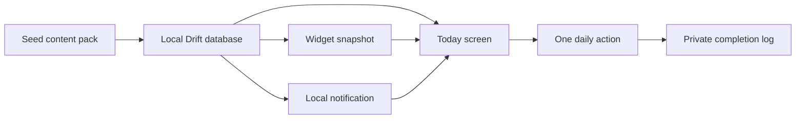

# Milestone 0 Foundation Decisions

Status: locked for beta on 2026-04-27  
Linear: DAN-113, DAN-114, DAN-116

Implementation artifacts for DAN-116:

- Identity manifest: `config/app_identity.json`
- Privacy copy bundle: `content/copy/privacy.vi.json`

## Insight

Sống Đạo wins by becoming a daily practice loop, not another Catholic reference library. The beta must prove one behavior: a user opens or sees the app every day, receives one clear Catholic action, completes it privately, and can return through the widget or reminder.

## Decision

Ship the beta around the local-first Today loop:

## Beta MVP Scope

| Feature | User outcome | Product lever |
|---|---|---|
| Today screen | User understands today in under 10 seconds. | Activation |
| Daily Action Engine | User receives one concrete Catholic action, not a content dump. | Retention |
| Local database | Today, completion, notes, and widget data work offline. | Retention |
| Vietnamese seed pack | Beta works without backend dependency. | Activation |
| Completion + private note | User builds a rhythm without public pressure. | Retention |
| iOS widget snapshot | User sees the daily action before opening the app. | Retention |
| Local reminders | User returns at the right moment without an account. | Retention |
| Basic parish selection | User can set "My parish" without location permission. | Activation |
| Important Mass card | Sunday/solemnity Mass becomes part of the daily flow. | Retention |
| Gentle progress | User sees private consistency without shame or scoring. | Retention |
| Prayer basics | Daily actions have a small offline support surface. | Retention |
| Settings/privacy | User can trust and control local-first behavior. | Activation |

## Beta Non-goals

| Non-goal | Reason to cut |
|---|---|
| Full Bible | Licensing and scope risk; reading references are enough for beta. |
| Full breviary | Directly competes with mature apps and expands content licensing. |
| Social network | Weakens privacy and distracts from daily practice retention. |
| AI priest/confessor | Pastoral and safety risk; not needed for the first retention loop. |
| Livestream Mass platform | Distribution-heavy and outside the local-first wedge. |
| Public faith score | Pastoral risk; contradicts private rhythm positioning. |
| Account system | Blocks activation and is not needed for offline beta. |
| Payment | Monetization can wait until retention is proven. |
| Mass attendance proof | Privacy-sensitive and not needed for self-check completion. |
| Full map church finder | Google Maps already wins maps; manual parish selection is enough. |

## Build Path

1. Scaffold Flutter shell with theme and five tabs.
2. Implement Drift schema and seed importer.
3. Import the 14-day Vietnamese content pack.
4. Generate one daily action from local context.
5. Build Today with completion and private note.
6. Write widget snapshot JSON.
7. Add iOS widget and App Group storage.
8. Add local notifications and Today deep links.
9. Add parish selection and Important Mass logic.

The priority order is intentionally narrow: **Today -> completion -> widget snapshot**. Anything that does not strengthen that path waits.

## App Identity

| Field | Decision |
|---|---|
| Display name | Sống Đạo |
| ASCII/internal name | SongDao |
| Product category | Catholic daily practice app |
| Bundle ID | `com.dantino.songdao` |
| iOS App Group direction | `group.com.dantino.songdao` |
| Widget bundle direction | `com.dantino.songdao.TodayWidget` |
| Default locale | Vietnamese (`vi`) |
| First platform | iOS-first Flutter app with native WidgetKit extension |

Flutter/iOS scaffold should treat `config/app_identity.json` as the source of truth for display name, bundle identifiers, App Group, and widget identifiers.

## Privacy Copy

Use this exact foundation copy unless product testing shows confusion:

> Your practice history stays on this device unless you choose backup.

Vietnamese:

> Lịch sử thực hành của bạn được lưu trên thiết bị này, trừ khi bạn chọn sao lưu.

First-run trust language:

> Sống Đạo works offline for today's action, completion history, notes, and widget data. Location is only requested if you choose nearby church search later.

Vietnamese:

> Sống Đạo hoạt động ngoại tuyến cho việc hôm nay, lịch sử hoàn thành, ghi chú và dữ liệu widget. Vị trí chỉ được hỏi nếu sau này bạn chọn tìm nhà thờ gần mình.

Settings privacy text:

> Practice logs and reflection notes are local by default. Sync, analytics, and location are optional controls, not requirements.

Vietnamese:

> Lịch sử thực hành và ghi chú suy niệm mặc định chỉ lưu trên máy. Đồng bộ, phân tích sử dụng và vị trí là tuỳ chọn, không bắt buộc.

Flutter onboarding/settings copy should load the matching keys from `content/copy/privacy.vi.json` or mirror them exactly in generated localization files.

Avoid:

- "Faith score"
- "You failed today"
- "Prove you attended Mass"
- "Become a better Catholic"
- Public ranking or attendance verification language

## Legally Safe Content And Citation Policy

### Reading Policy

Use reading references by default. Do not ship full copyrighted Bible or lectionary text in the beta unless a license is explicitly recorded in content metadata.

Allowed beta reading display:

- Citation: `Cv 14,5-18`
- Reading type: first reading, psalm, gospel, optional second reading
- Official source URL when available
- Short public-domain excerpt only when the source license clearly permits app redistribution
- Optional user-facing link: "Read at source"

Blocked beta reading display:

- Full copyrighted lectionary text
- Scraped readings without redistribution rights
- Text copied from third-party apps
- Ambiguous "fair use" content packs

### Liturgical Calendar Policy

Calendar metadata may include date, season, color, cycle year, rank, celebration title, Sunday/solemnity/holy-day flags, and source attribution. Every imported calendar record must identify its source and pack version.

### Prayer Policy

Prefer prayers that are traditional, public-domain, or explicitly licensed for redistribution. Every prayer entry must include source and license metadata. If licensing is unclear, store only a title and external source link until resolved.

### Parish And Mass Policy

Parish directory and Mass time records must include source and `verified_at`. If Mass time freshness is unknown or stale, the UI should say so plainly instead of pretending certainty.

### Content Metadata Required

Every seed pack includes:

- `pack_id`
- `version`
- `locale`
- `created_at`
- `source_summary`
- `license_summary`
- `checksum`

Every imported content row includes enough source metadata to trace where it came from.

### Allowed Beta Seed Sources

| Content type | Allowed beta source | License/source note | Beta handling |
|---|---|---|---|
| Calendar days | Internally curated demo calendar records | `internal-demo` until official calendar source is selected | Allowed for development and TestFlight only |
| Celebrations | Internally curated Vietnamese labels | `internal-demo` with source row metadata | Allowed for beta if marked as demo/curated |
| Reading references | Citation-only references from approved liturgical calendar planning | `reference-only` | Allowed; no full text |
| Reading text | Public-domain or explicitly licensed source only | Must name license and source URL | Blocked until license metadata is present |
| Action rules | Original SongDao copy | `internal` | Allowed |
| Prayer titles | Traditional/common prayer titles | Source required | Allowed |
| Prayer bodies | Public-domain or explicitly licensed source only | Must name license and source URL | Blocked until reviewed |
| Parish directory | Manually curated beta seed records | Source and `verified_at` required | Allowed with stale-data warning support |
| Mass times | Manually curated beta seed records | Source and `verified_at` required | Allowed; stale/unknown data must be shown honestly |

### Licensing Blockers

These are blockers, not TODOs to hide in implementation:

- Full Vietnamese Bible or lectionary text without redistribution rights.
- Prayer bodies with unclear copyright status.
- Parish or Mass data copied from third-party apps without permission.
- Any content pack missing source, locale, version, or checksum metadata.

## Milestone 0 Exit Criteria

- MVP scope and non-goals are documented.
- Legal content policy defaults to references over full copyrighted text.
- Seed pack format is specified separately in `docs/content-pack-format.md`.
- App identity, bundle ID, App Group direction, and privacy copy are locked.
- Today and widget wireframes are specified in `docs/today-widget-wireframes.md`.
