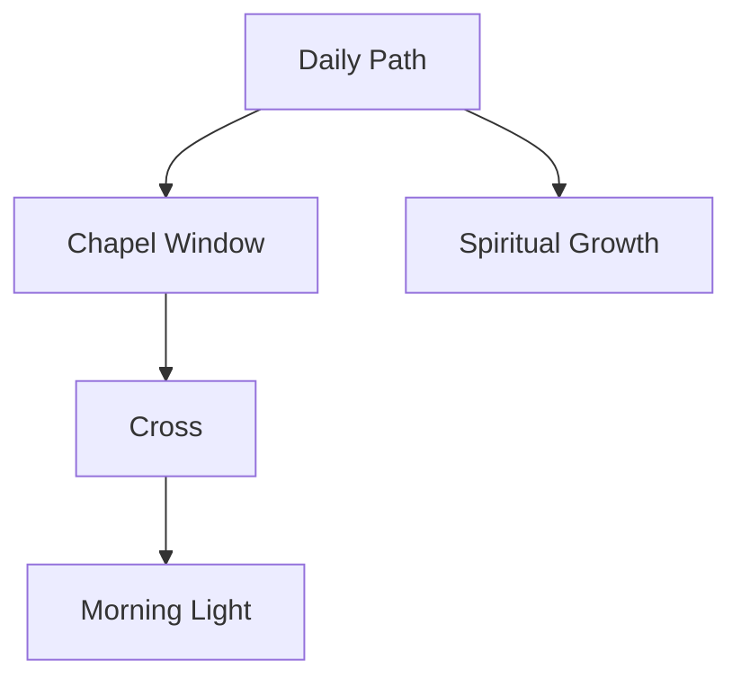
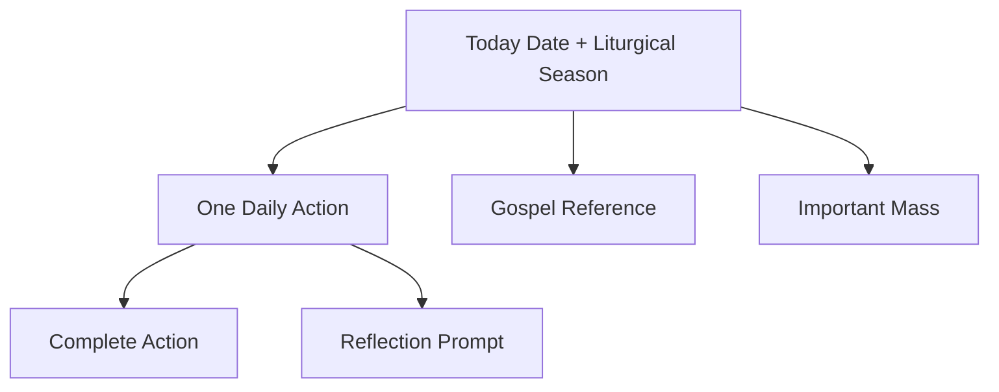
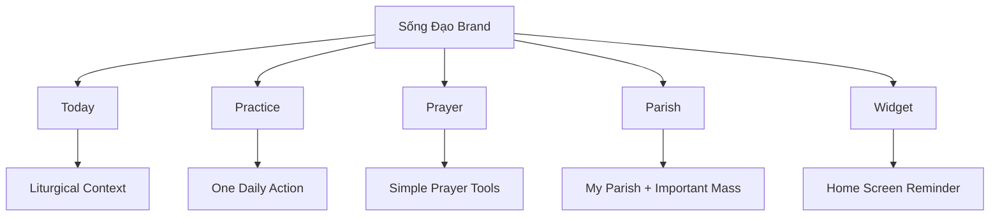

# Sống Đạo — Brand Identity & Design System


![[Logo-SongDao.png]]

## 1. Brand Core

**Brand name:** Sống Đạo  
**Product meaning:** Living the Catholic faith through small daily actions.  
**Category:** Catholic daily practice app.  
**Positioning:** Not another Catholic calendar or Bible app. Sống Đạo should be a **daily practice companion** that turns liturgical context into one concrete action. This matches the product strategy: the calendar, readings, feast days, Mass schedules, and Bible references are inputs; the real product is the daily action engine.

## 2. Brand Promise

> **Một việc nhỏ mỗi ngày để sống đức tin.**  
> One small act each day to live the faith.

The brand should feel:

|Attribute|Meaning|
|---|---|
|Sacred|Clearly Catholic, rooted in prayer and liturgy|
|Practical|Helps the user act today, not only read|
|Calm|No guilt, no pressure, no religious noise|
|Local-first|Works offline, private by default|
|Vietnamese|Familiar, warm, parish-connected|
|Premium|Clean enough for iOS App Store quality|

---

# 3. Logo Meaning

The improved logo should tell this story:



## Chapel Window

The chapel window gives immediate Catholic identity.

It means:

- sacred space
    
- prayer
    
- Church tradition
    
- quiet presence
    
- spiritual refuge
    

It should not look like a heavy church building. A window is better because it feels personal: the app becomes a small spiritual doorway inside daily life.

## Cross

The cross is the center of the brand.

Meaning:

> Christ is not decoration. Christ is the structure of the journey.

The cross should be integrated into the window geometry, not pasted on top. This makes the logo modern, subtle, and trustworthy.

## Morning Light

The warm light represents:

- new day
    
- grace
    
- resurrection
    
- hope
    
- daily renewal
    

This connects directly to the Today screen concept: every day the app gives the user one clear Catholic action, not a long content feed.

## Path

The path is the most important differentiator.

Meaning:

> Faith is walked, not only read.

This is the visual meaning of **Sống Đạo**. The app helps users move from liturgical information into lived practice.

## Leaf / Growth

The leaf represents:

- gentle growth
    
- spiritual renewal
    
- ordinary-life holiness
    
- consistency over intensity
    

Keep it secondary. The leaf should support the path, not compete with the cross.

---

# 4. Color Palette

## Primary Brand Palette

|Token|Hex|Use|Meaning|
|---|--:|---|---|
|Warm Off-white|`#FAF8F3`|App background, cards, icon background|Prayer notebook, calm, paper, warmth|
|Chapel Green|`#1F7A64`|Primary buttons, logo frame, active states|Ordinary Time, life, stability, Vietnamese Catholic familiarity|
|Soft Green|`#E2F1EA`|Path, soft surfaces, secondary cards|Growth, gentleness, renewal|
|Sacred Gold|`#B8892E`|Accent lines, feast highlights, icon detail|Liturgy, dignity, sacred light|
|Ink Shadow|`#1F2522`|Main text, icon shadows|Trust, clarity, seriousness|

## Liturgical Palette

Use liturgical colors as contextual accents, not as the whole brand.

|Liturgical Color|Hex|Use|
|---|--:|---|
|Green|`#2E7D32`|Ordinary Time|
|Purple|`#6A1B9A`|Lent / Advent|
|Red|`#C62828`|Martyrs / Passion / Holy Spirit|
|White|`#F5F3EA`|Easter / Christmas / solemnities|
|Gold|`#C9A227`|High feasts / premium highlights|
|Rose|`#C97B8D`|Gaudete / Laetare optional accent|

Rule: **brand green remains primary; liturgical colors appear as small indicators.**

---

# 5. Typography Direction

## Recommended type style

Use a clean modern sans-serif with warm human feeling.

|Role|Style|
|---|---|
|App title|Semi-bold, calm, not decorative|
|Headings|Strong but soft|
|Body|Highly readable|
|Prayer / reflection text|Slightly more spacious line-height|

## Suggested font direction

For Flutter/iOS:

- **Primary:** SF Pro / system font
    
- **Vietnamese-friendly alternative:** Inter, Be Vietnam Pro, or Noto Sans
    

Best choice for Vietnam-first:

> **Be Vietnam Pro**

It supports Vietnamese well and feels local without looking old-fashioned.

---

# 6. Visual Design Language

## Overall style

**Quiet chapel notebook.**

The app should feel like:

- a prayer journal
    
- a liturgical companion
    
- a calm iOS utility
    
- a private spiritual rhythm tracker
    

Not like:

- a social religious app
    
- a Bible encyclopedia
    
- a church database
    
- a motivational habit tracker
    

## Shape language

|Element|Shape|
|---|---|
|Cards|Soft rounded rectangles|
|Primary action card|Large calm surface|
|Buttons|Pill or rounded rectangle|
|Date/liturgical tag|Small capsule|
|Iconography|Simple line icons|
|Logo|Chapel arch + path|

## Depth

Use subtle depth only:

```text
Soft shadow
Low contrast
Paper-like layers
No glossy 3D UI
No heavy gradients
```

The app icon can be layered and premium. The app interface should be quieter.

---

# 7. App Icon Design Spec

## Final icon concept

> A daily spiritual path leading toward Christ through a chapel window.

## Composition

|Layer|Description|
|---|---|
|Background|Warm off-white square, no rounded-corner tile baked in|
|Main symbol|Centered chapel window|
|Center|Subtle cross with warm morning light|
|Foreground|Green path leading upward|
|Secondary|Small leaf on side|
|Accent|Thin gold line along path or window edge|

## App Store requirements

- 1024 × 1024 px
    
- true square artwork
    
- no transparent background
    
- no text
    
- no letters
    
- no baked rounded corners
    
- strong contrast at small size
    

## Small-size readability rule

At 60 px, the user must still see:

1. chapel silhouette
    
2. cross
    
3. path
    

If the leaf disappears at small size, that is acceptable. If the path disappears, redesign.

---

# 8. UI Design System

## Core Screens

Your MVP UI should prioritize the Today screen, widget layout, action card, parish card, basic calendar, and simple progress view. This matches the wireframe priority order.

## Today Screen Visual Hierarchy



## Component Hierarchy

|Component|Brand Role|
|---|---|
|Today Header|Grounds user in liturgical day|
|Daily Action Card|Main product value|
|Gospel Card|Supporting context|
|Mass Card|Parish-connected utility|
|Progress Card|Private rhythm, not public score|
|Widget|Daily surface outside the app|

---

# 9. Core UI Components

## Daily Action Card

Most important component.

Design:

- large card
    
- warm off-white or soft green surface
    
- one action only
    
- clear primary button
    
- optional note button
    

Copy style:

```text
Việc hôm nay
Cầu nguyện 5 phút

Xin Chúa chỉ cho bạn một người cần được yêu thương hôm nay.

[Đã làm xong]
[Viết ghi chú]
```

## Liturgical Context Tag

Small capsule:

```text
Mùa Phục Sinh · Trắng
```

Use liturgical color as a small dot or vertical bar.

## Important Mass Card

Should feel useful, not dominant.

```text
Thánh lễ quan trọng
Chúa Nhật · 07:00
Giáo xứ Tân Định
```

## Progress Card

Avoid “score.”

Use:

- “Nhịp sống đạo”
    
- “Tuần này”
    
- “Bạn đã giữ nhịp 4/7 ngày”
    

Avoid:

- “Faith score”
    
- “Ranking”
    
- “Better Catholic”
    

The PRD explicitly warns against making practice tracking feel like a public virtue scoreboard.

---

# 10. Brand Voice

## Voice

Calm. Gentle. Concrete. Vietnamese Catholic but not heavy.

## Copy principles

|Do|Avoid|
|---|---|
|“Một việc nhỏ hôm nay”|“Bạn phải…”|
|“Giữ nhịp sống đạo”|“Điểm đức tin”|
|“Cầu nguyện 5 phút”|“Hoàn thành nhiệm vụ tôn giáo”|
|“Viết một suy niệm ngắn”|“Bắt buộc ghi nhật ký”|
|“Chọn một hy sinh nhỏ”|“Bạn chưa đủ tốt”|

## Sample Vietnamese copy

### App tagline

> **Sống đức tin mỗi ngày, bằng một việc nhỏ.**

### Onboarding

> Mỗi ngày, Sống Đạo gợi ý một việc đơn giản để bạn cầu nguyện, suy niệm, tham dự Thánh lễ, hoặc sống yêu thương cụ thể hơn.

### Completion

> Bạn đã hoàn thành việc hôm nay.

### Gentle reminder

> Hôm nay vẫn còn một việc nhỏ để sống đức tin.

---

# 11. Brand Architecture



## Product naming system

|Area|Recommended Vietnamese Name|
|---|---|
|Today screen|Hôm nay|
|Daily action|Việc hôm nay|
|Practice rhythm|Nhịp sống đạo|
|Prayer library|Cầu nguyện|
|Parish|Giáo xứ|
|Important Mass|Thánh lễ quan trọng|
|Notes|Suy niệm riêng|
|Widget|Nhắc nhớ hôm nay|

---

# 12. Brand Differentiation

Most Catholic apps compete on content volume.

Sống Đạo should compete on:

```text
Less content
More action
More rhythm
More privacy
More daily presence
```

The strongest product idea is:

> **Liturgical Data → One Action → Widget → Habit**

This is already captured in the wireframe as the app’s decision-engine UI.

---

# 13. Design Rules

## Must follow

1. One primary action per day.
    
2. Widget-first thinking.
    
3. Private by default.
    
4. Liturgical color as context, not decoration.
    
5. No cluttered religious imagery.
    
6. No guilt-based copy.
    
7. No social ranking.
    
8. No heavy saint/statue/photo aesthetic.
    
9. The path metaphor should remain central.
    
10. The app should work visually even offline and without dynamic content.
    

## Avoid

- stained glass overload
    
- golden luxury Catholic look
    
- dark cathedral mood
    
- generic wellness leaf branding
    
- text-heavy cards
    
- gamified virtue score
    
- AI priest/confessor visual language
    

---

# 14. Final Brand Statement

**Sống Đạo is a calm Vietnamese Catholic daily practice app that helps users take one small step of faith each day.**

The logo expresses:

> a path of daily practice leading toward Christ.

The interface should express:

> today, one action, private rhythm.

The brand should feel:

> sacred enough to be Catholic, practical enough to use every morning, and calm enough to stay with the user for years.